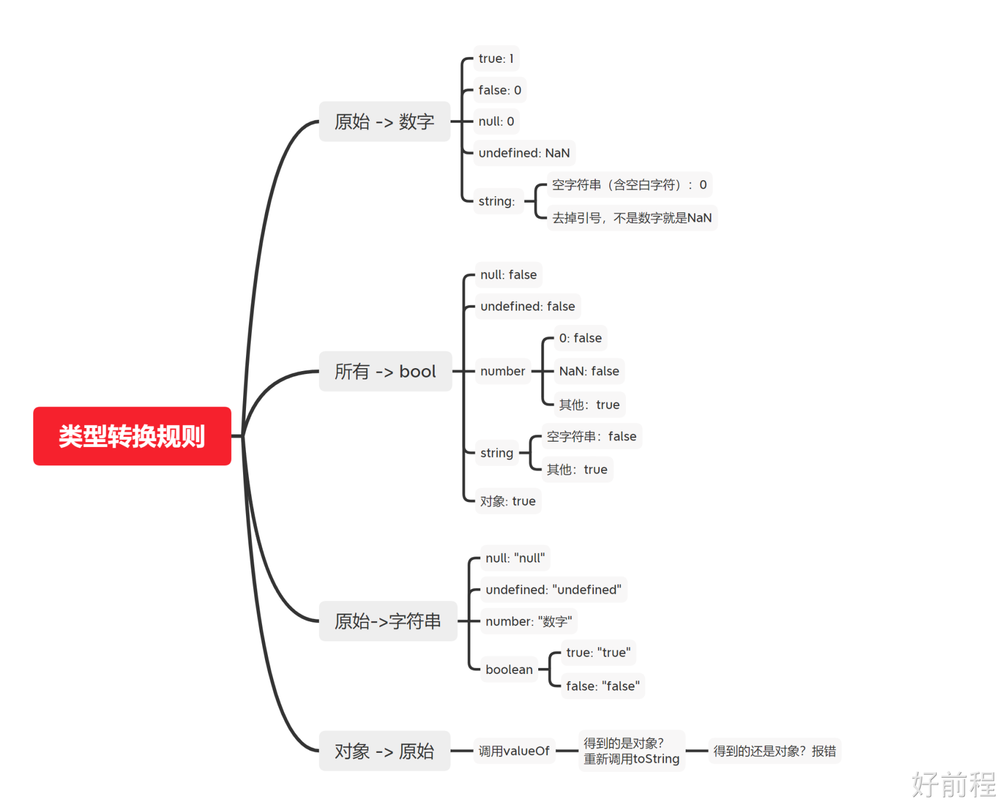
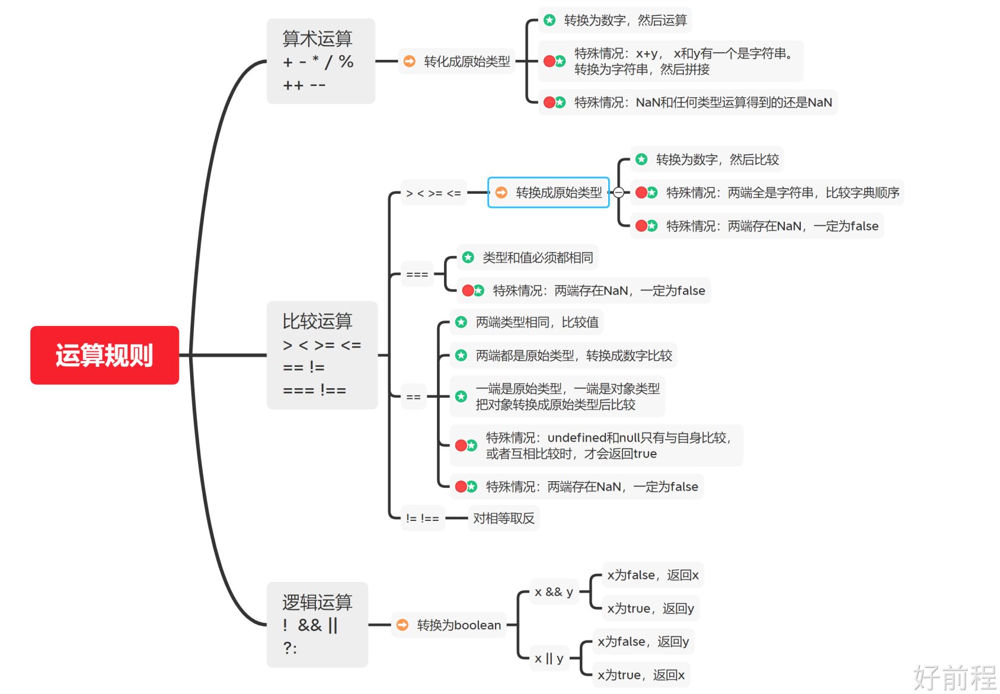
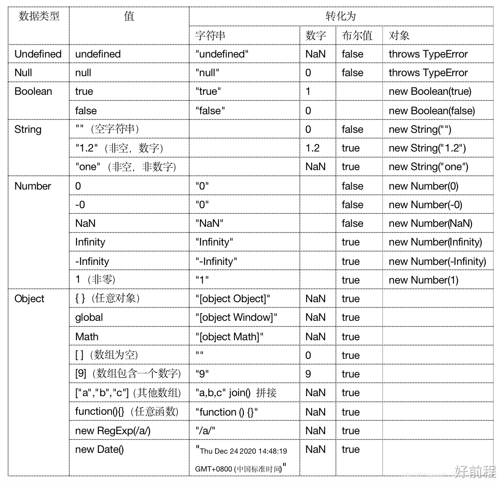

---
next:
  text: Dom对象
  link: /guide/二段/Dom对象.html
---
## 课程介绍

### **js在互联网的角色**

界面呈现、特效制作、用户交互、服务器通信、优化体验、构建全栈应用程序...

### js的发展历史

::: tip
1995年：最早的JavaScript。由Netscape公司（现在的Mozilla）的Brendan Eich开发而成，最初命名为"LiveScript"，后来改名为"JavaScript"。JavaScript的目标是为网页添加动态和交互性。

1996年：IE的JScript。微软推出了自己的JavaScript实现，命名为"JScript"，并集成到Internet Explorer浏览器中。这促进了JavaScript的普及，并使其成为主流的浏览器脚本语言。

1997年：ECMAScript标准化。为了确保JavaScript的跨平台和互操作性，欧洲计算机制造商协会（ECMA）制定了ECMAScript标准。ECMAScript定义了JavaScript的基础语法、数据类型、操作符等规范，从而使不同的JavaScript实现能够相互兼容。

2004年：AJAX的出现。AJAX（Asynchronous JavaScript and XML）的概念被提出，它利用JavaScript和XML实现了异步数据传输和无需刷新页面即可更新内容的能力，极大地改善了用户体验。

2006年：jQuery的发布。jQuery是一个流行的JavaScript库，简化了JS与HTML文档交互、事件处理、动画效果等方面的开发。它大幅简化了JavaScript编程，并提供了跨浏览器兼容性解决方案。

2009年：Node.js的出现。由Ryan Dahl开发的Node.js使JavaScript脱离了浏览器环境，可以在服务器端用于构建高性能和可扩展的网络应用程序。这对于JavaScript的应用范围和生态系统产生了革命性的影响。

2015年：ECMAScript 2015（ES6）发布。ES6引入了许多新的语言特性和改进，如箭头函数、模块化、类等，显著提升了JavaScript的开发效率和可维护性。

之后的发展：自2015年以来，ECMAScript每年都在发布新的版本，持续改进和丰富了JavaScript的功能和语法。例如，ES7引入了async/await等异步编程的语法糖，ES8引入了对象属性的更多操作和函数参数的展开语法等。
:::

### js的运行环境

::: tip
JavaScript可以在多个不同的运行环境中执行。以下是一些常见的JavaScript运行环境：

浏览器环境：最常见的JavaScript运行环境是浏览器。现代的Web浏览器（如Chrome、Firefox、Safari和Edge）都内置了JavaScript解析器，可以直接在浏览器中执行JavaScript代码。JavaScript通过操作文档对象模型（DOM）和浏览器提供的API，实现与用户的交互、动态更新网页内容等功能。

服务器环境：JavaScript也可以在服务器端运行。Node.js是一个基于V8引擎的JavaScript运行时，它使得开发者能够使用JavaScript来编写服务器端应用程序。Node.js提供了许多内置模块和包管理工具，方便开发者进行服务器端的网络通信、文件操作等任务。

移动应用环境：JavaScript还可以用于开发移动应用程序。通过使用跨平台开发框架（如React Native、Ionic和Flutter），开发者可以使用JavaScript来构建跨平台的原生移动应用。这些框架将JavaScript代码转换为原生代码，以便在iOS和Android等移动平台上运行。

桌面应用环境：JavaScript也可以用于构建桌面应用程序。Electron是一个开源的桌面应用开发框架，它使用JavaScript、HTML和CSS来构建跨平台的桌面应用程序。许多知名的应用程序，如Visual Studio Code、Slack和Atom等，都是使用Electron开发的。

嵌入式设备环境：随着物联网的发展，JavaScript也开始在嵌入式设备上运行。例如，一些智能家居产品和传感器使用JavaScript作为其控制和交互的脚本语言。
:::

#### 第一行代码

::: tip hello world!
在页面和控制台显示hello world!

```javascript
<script>
    //页面
    document.write("hello world!");
    //控制台
    console.log("hello world!");
</script>
```

:::

### js的使用方式

::: tip 三种方式
1.内部 JavaScript： `<br>`
&emsp;&emsp;在 HTML 页面中，JavaScript 代码可以直接放在 `<script>` 标签中。`<br>`
2.外部 JavaScript`<br>`
&emsp;&emsp;在 HTML 页面中，JavaScript 代码可以放在外部文件中。外部文件通常包含被多个网页使用的代码。`<br>`
3.内联 JavaScript 处理器`<br>`
&emsp;&emsp; 在 HTML 页面中，JavaScript 代码可以放在事件处理器中。`<br>`
:::
::: tip 脚本调用策略
脚本调用策略 async,defer
如果脚本无需等待页面解析，且无依赖独立运行，那么应使用 async。异步加载
如果脚本需要等待页面解析，且依赖于其它脚本，调用这些脚本时应使用 defer，将关联的脚本按所需顺序置于 HTML 中。同步加载
:::
小练习：`<br>`
`1.在页面中写入多个脚本标签写入不同的代码查看执行的顺序<br>`
`2.引入多个JS文件 并在JS文件种写入不同的代码查看执行的顺序`

#### js中的基本语法

::: tip
1.区分大小写`<br>`
2.每条语句以分号结束`<br>`
3.注释：单行注释：//  多行注释：/* */`<br>`
4.代码块：用花括号括起来的代码片段`<br>`
5.标识符：变量、函数、属性的名字，或者函数的参数`<br>`
6.关键字：保留字`<br>`
7.变量：用于保存值的占位符`<br>`
8.数据类型：基本数据类型（number、string、boolean、null、undefined）和复杂数据类型（object）`<br>`
9.变量声明：var、let、const`<br>`
10.变量作用域：全局变量、局部变量`<br>`
11.变量提升：变量声明会被提升到当前作用域的顶部，但是初始化不会提升`<br>`
12.变量的命名规则：驼峰命名法、匈牙利命名法 、见名知意、不能使用关键字、不能以数字开头、不能包含空格和特殊字符、区分大小写`<br>`
:::

#### Js的输出

::: tip
● 使用 window.alert() 写入警告框`<br>`
● 使用 document.write() 写入 HTML 输出`<br>`
● 使用 console.log() 写入浏览器控制台`<br>`
● 使用 window.confirm() 确认或取消框 （tips: window可以省略！）`<br>`
● 使用 window.prompt()  如果您希望用户在进入页面前输入值，`<br>`
通常会使用提示框 （tips:折行 - 如需在弹出框中显示折行，请在反斜杠后面加一个字符 n）`<br>`
:::
`现在有一个小作业需要你来完成~！ 使用上方的弹框和输出和打印 分别打印出你的名字~`

当然控制台也有一些花式输出~ [点击查看此网页](https://www.icode9.com/content-4-809873.html)

## 变量

学习之前首先抛出三个问题
::: tip 什么是变量？
变量是存储信息的容器。这些信息可以是数字、字符串、数组、对象等等。
:::
::: tip 变量有什么作用？
变量可以用来存储信息，这些信息可以是数字、字符串、数组、对象等等。
:::
::: tip 如何使用变量？
在存储信息的容器中使用变量  创建一个变量并将其存储到变量中

```javascript
var a = 1;
```

将其存储到变量中将其显示在你的页面上

```javascript
document.write(a);
```

:::

### 1.声明变量

::: tip
在 JavaScript 中创建变量通常称为“声明”变量。
要声明 JavaScript 变量，请使用 var 关键字，然后是变量名称：

```javascript
var a;
```

:::

### 2.初始化变量

::: tip
在 JavaScript 中，初始化变量的最佳位置是在声明时。
您可以在声明变量时初始化变量：

```javascript
var a = 1;
```

:::

### 3.重新声明变量

::: tip
如果重新声明 JavaScript 变量，该变量的值不会丢失：

```javascript
var a = 1;
var a;
```

:::

### 4.重新赋值变量

::: tip
如果重新分配 JavaScript 变量，该变量的值将被覆盖：

```javascript
var a = 1;
a = 2;
```

:::

### 5.变量的作用域

::: tip
在 JavaScript 中，变量的作用域是函数。
在函数内声明的变量的作用域是该函数,因为它只能在当前函数的内部访问。
在函数外声明的变量的作用域是全局,因为它可被当前文档中的任何其他代码所访问。
:::

### 6.变量提升

`JavaScript 变量的另一个不同寻常的地方是，你可以先使用变量稍后再声明变量而不会引发异常。这一概念称为变量提升；JavaScript 变量感觉上是被“提升”或移到了函数或语句的最前面。但是，提升后的变量将返回 undefined 值。因此在使用或引用某个变量之后进行声明和初始化操作，这个被提升的变量仍将返回 undefined 值`

### 7.运算符

<style>
table {
  margin-left: auto;
  margin-right: auto;
}
</style>

1、算数运算符

| 运算符 | 描述         | 举例         | x的值 | y的值 |
| ------ | ------------ | ------------ | ----- | ----- |
| +      | 加法         | x=y+2        | 7     | 5     |
| -      | 减法         | x=y-2        | 3     | 5     |
| *      | 乘法         | x=y*2        | 10    | 5     |
| /      | 除法         | x=y/2        | 2.5   | 5     |
| %      | 取模（余数） | x=y%2        | 1     | 5     |
| ++     | 自增         | y=5    x=++y | 6     | 6     |
|        |              | y=5   x=y++  | 5     | 6     |
| --     | 自减         | y=5   x=--y  | 4     | 4     |
|        |              | y=5   x=y--  | 5     | 4     |

3、比较运算符

| 运算符 | 描述                                               | 实例    |
| ------ | -------------------------------------------------- | ------- |
| <      | 小于                                               | x < y   |
| <=     | 小于或等于                                         | x <= y  |
| >      | 大于                                               | x > y   |
| >=     | 大于或等于                                         | x >= y  |
| ==     | 相等（）                                           | x == y  |
| ===    | 严格相等（值和类型均相等）                         | x === y |
| !=     | 不相等                                             | x != y  |
| !==    | 严格不相等（值和类型有一个不相等，或两个都不相等） | x !== y |

4、赋值运算符

| 运算符 | 例子 | 等同于 | 运算结果 |
| ------ | ---- | ------ | -------- |
| =      | x=y  |        | x=5      |
| +=     | x+=y | x=x+y  | x=15     |
| -=     | x-=y | x=x-y  | x=5      |
| *=     | x*=y | x=x*y  | x=50     |
| /=     | x/=y | x=x/y  | x=2      |
| %=     | x%=y | x=x%y  | x=0      |

5、逻辑运算符

| 运算符 | 描述           | 实例            |
| ------ | -------------- | --------------- |
| &&     | 逻辑与    and  | x && y          |
|        |                |                 |
| !      | 逻辑非    not  | !(x==y) 为 true |
| ? :    | 条件(三元运算) | ? "Yes" : "No"  |

6、运算符优先级

| 运算符     | 顺序                              |
| ---------- | --------------------------------- |
| 小括号     | （）                              |
| 递增、递减 | ++ --                             |
| 算数运算符 | 先* /%后+-                        |
| 关系运算符 | >  >=   <   <=   ==  !=  ===  !== |
| 逻辑运算符 | 先&&后                            |
| 赋值运算符 | =                                 |

## 控制语句

### if语句

```javascript
// if语句 （单分支）——只有当指定条件为 true 时，使用该语句来执行代码
if (条件表达式) {
  如果条件为 true 时执行的代码
}
//if...else语句（双分支）——当条件为 true 时执行代码，当条件为 false 时执行其他代码（双分支语句）
if (条件) {
  条件为 true 时执行的代码块
} else { 
  条件为 false 时执行的代码块
}
//if...else if...else...语句（多分支)——使用该语句来选择多个代码块之一来执行
if (条件 1) {
  条件 1 为 true 时执行的代码块
} else if (条件 2) {
  条件 1 为 false 而条件 2 为 true 时执行的代码块
} else {
  条件 1 和条件 2 同时为 false 时执行的代码块
}
```

::: tip 实例讲解

```javascript
var money = prompt('请输入金额')
  if (money >= 1000) {
      console.log('买四合院');
  } else if (money < 1000 && money >= 800) {
      console.log('买别墅');
  } else if (money < 800 && money >= 500) {
      console.log('150平米的房子');
  } else if (money < 500 && money >= 100) {
      console.log('小房子');
  } else {
      console.log('买个屁');
  }
```

:::
`作业：成绩：90+A；80~90B;60-80C;60-D`

### switch

::: tip switch分支语句
使用该语句来选择多个代码块之一来执行(针对变量设置一系列特定值的选项时,可以使用switch语句)

● 计算一次 switch 表达式
● 把表达式的值(n)与每个 case 的值(value)进行对比   n === value
● 如果存在匹配，则执行关联代码

```javascript
switch(表达式) {
  case value1:
    代码块
    break;
  case value2:
    代码块
    break;
  case value3:
    代码块
    break;
  default:
    默认代码块;
}
```

:::
::: warning 注意：
1、表达式可以（经常写成变量）
2、表达式的值和case后面的value值匹配是全等
3、break 如果当前case里面没有break，则不会退出switch，继续执行下一个case
:::
`break`关键字——跳出循环（结束循环）
&emsp;&emsp;遇到 break 关键词，它会跳出 switch 代码块。
&emsp;&emsp;此举将停止代码块中更多代码的执行以及 case 测试。
&emsp;&emsp;如果找到匹配，并完成任务，则随机中断执行（break）。无需更多测试。
&emsp;&emsp;break 能够节省大量执行时间，因为它会“忽略” switch 代码块中的其他代码的执行。
&emsp;&emsp;不必中断 switch 代码块中的最后一个 case。代码块在此处会自然结束。
`default`关键字
&emsp;&emsp;关键词规定不存在 case 匹配时所运行的代码
::: details 练习
作业0：用户输入一个数,来判断是奇数还是偶数
作业1：计算器
作业2：先输入年份 在输入一个月份,显示当月的天数,使用 switch case实现 （需要注意判断的是2月的天数 闰年和平年不一样）
作业3：输入一个月份 和日期，显示出星座
:::

### for循环语句

将代码块重复执行N次
::: tip 基础语法

```javascript
for (语句 1; 语句 2; 语句 3)
{
  被执行的代码块（循环体）
}
```

语句 1: （代码块）开始前执行 ——初始化循环中变量：就是var声明一个普通变量，通常用于作为计数器使用
语句 1 是可省略（在循环前已设置过）可初始化任意（或者多个）值

语句 2: 定义运行循环（代码块）的条件——条件表达式：用来决定每一次循环是否继续执行（就是终止条件）

语句 3: 每次循环最后执行的代码， 在循环（代码块）已被执行之后执行；常用于计数器变量进行更新（递增或递减）
:::
::: tip 跳过和跳出循环
`break` 语句用于立即终止循环并跳出循环体，执行循环后面的代码。
`continue` 语句用于跳过当前循环中的某些迭代，并继续执行下一次迭代。
:::
::: tip 实例讲解

```javascript
//打印1-100之间的偶数
for (var i = 1; i <= 100; i++) {
    if (i % 2 == 0) {
        console.log(i);
    }
}
```

:::
::: details 练习题
1.打印1到10
2.打印10到1
3.打印0到20之间所有偶数
4.打印1到20之间所有奇数
5.求1-100的总和
6.求99至999的所有奇数的总和和所有偶数的总和
7.打印1到100之间所有能被3整除的数
8.打印1到100之间所有能被3和5整除的数
9.求 0.1 + 0.2 + 0.3 +0.4 + 0.5  …1.0+1.1+.... +10 的总和
10.在浏览器上打印1 - 1000之间能同时被3、5、7整除的整数
11. 1/1+1/2+1/3…+1/20 使用for循环求和
12. 1-1/2+1/3-1/4+1/5-1/6…-1/100 使用for循环 算出结果
13. 输入一个整数，页面输出该整数的所有因数
:::
::: tip 双层for循环

```javascript
for (外层初始变量; 外层条件语句; 外层语句 3)
{
  for (内层初始变量; 内层条件语句; 内层语句 3)
  {
    被执行的代码块（循环体）
  }
}
```

给循环起名字 可以指定停止某个循环

```javascript
ppp:
  for (var i = 0; i < 10; i++) { //for1
      for (var j = 0; j < 10; j++) { //for2
          if (i == 1) {
              break ppp; //停止ppp循环
          }
          console.log(i);
      }  
  }
```

:::
::: details 双层循环练习题
0.打印一个5行5列的正方形
1.打印一个由"*" 组成的直角三角形，要求输入三角形的高度
2.打印一个由"*" 组成的等边三角形，要求输入三角形的高度
3.打印一个倒立的等边三角形，要求输入三角形的高度
4.打印九九乘法表
5.打印一个菱形
:::

### while循环语句

::: tip while
只要指定条件为 true，循环就可以一直执行代码块

```javascript
// 当表达式结果为true，则执行循环体，否则退出循环
while (条件表达式)
{
  循环体
}
```

:::
::: tip do...while语句
while 循环体。该循环会在检查条件是否为真之前执行一次代码块，然后如果条件为真的话，就会重复这个循环

```javascript
do
{
  循环体；
}
while (条件表达式);
```

跟while不同的地方在于do while先执行循环体，再判断条件，如果表达式结果为真，则继续执行循环体，否则退出循环
:::
::: details 练习题

1. 从1加到100
2. 从1加到100，但是只加偶数
3. 从1加到100，但是只加奇数
4. 从1加到100，但是只加能被3整除的数
5. 从1加到100，但是只加能被3整除的数，但是不包括能被5整除的数
   6.一张纸0.00001m对折多少次超过珠穆朗峰的高度8848m 使用while循环实现
   7.有一个棋盘，有64个方格，在第一个方格里面放1粒芝麻重量是0.00001kg，
   第二个里面放2粒，第三个里面放4，求棋盘上放的所有芝麻的重量
   8.公园里有一只猴子和一堆桃子，猴子每天吃掉桃子总数的一半，
   把剩下一半中扔掉一个坏的。到第七天的时候，猴子睁开眼发现只剩下一个桃子。
   问公园里刚开始有多少个桃子？
   :::
   ::: tip 小测验1
   假设一个简单的ATM机的取款过程是这样的：
   首先提示用户输入密码（password），最多只能输入三次，
   超过3次则提示用户“密码错误，请取卡”结束交易。
   如果用户密码正确，再提示用户输入取款金额（amount），
   ATM机只能输出100元的纸币，一次取钱数要求最低100元，最高1000元。
   若用户输入的金额符合上述要求，则打印输出用户取得钱数，
   最后提示用户“交易完成，请取卡”，否则提示用户重新输入金额。
   假设用户密码是111111，请编程实现。
   :::
   ::: tip 小测验2
   假设你正在开发一个简单的购物网站，购买流程如下：
   首先提示用户输入账户名（username）和密码（password），
   最多只能输入三次，超过3次则提示用户“账户名或密码错误，请重新注册”结束交易。
   如果用户账户名和密码正确，再提示用户输入购买金额（amount），
   购物网站只支持支付宝付款，一次最低购买金额为10元，最高为100元。
   若用户输入的金额符合上述要求，则打印输出用户购买的商品及其价格，
   最后提示用户“交易完成，感谢购买”，否则提示用户重新输入金额。
   假设用户账户名为"John"，密码为"123456"，请编程实现。。
   :::
   ::: tip 小测验3
   假设你正在开发一个简单的图书管理系统，借阅流程如下：
   首先提示用户输入图书馆账户名（username）和密码（password），
   最多只能输入三次，超过3次则提示用户“账户名或密码错误，请重新注册”结束交易。
   如果用户账户名和密码正确，再提示用户输入借阅书籍的ISBN号码（isbn），
   如果图书馆中有这本书，并且这本书当前没有被借出，则借出这本书并记录借阅信息，
   并且打印输出借阅成功的信息，包括书名、作者、借阅时间等。
   如果这本书已经被借出，则提示用户这本书已经被借出，并让用户重新输入ISBN号码。
   如果这本书不存在，则提示用户这本书不存在，并让用户重新输入ISBN号码。
   最后提示用户“交易完成，请及时归还书籍”，否则扣除用户的信用分。
   假设图书馆账户名为"library"，密码为"123456"，请编程实现。
   :::

### 浏览器调试

::: tip PS
断点调试:
断点调试是指自己在程序的某一行设置一个断点 ,调试时,程序运行到这一行就会停住 ,然后你可以-步-步往下调试,调试过程中可以看各个变量当前的值,出错的话,调试到出错的代码行即显示错误,停下。
断点调试可以帮我们观察程序的运行过程
浏览器中按F12--> sources -->找到需要调试的文件->在程序的某-行设置断点
Watch:监视,通过watch可以监视变量的值的变化,非常的常用。
F11:程序单步执行,让程序一行行的执行 ,这个时候,观察watch中变量的值的变化。
:::

## 数据类型

最新的 ECMAScript 标准定义了 8 种数据类型

### 八种数据类型

::: tip

1. 七种基本数据类型：
   ①布尔值（Boolean），有 2 个值分别是：true 和 false.
   ②null，一个表明 null 值的特殊关键字。JavaScript 是大小写敏感的，因此 null 与 Null、NULL或变体完全不同。
   ③undefined，和 null 一样是一个特殊的关键字，undefined 表示变量未赋值时的属性。
   ④数字（Number），整数或浮点数，例如： 42 或者 3.14159。
   ⑤任意精度的整数 (BigInt) ，可以安全地存储和操作大整数，甚至可以超过数字的安全整数限制。
   ⑥字符串（String），字符串是一串表示文本值的字符序列，例如："Hello" 。
   ⑦代表（Symbol）( 在 ECMAScript 6 中新添加的类型).。一种实例是唯一且不可改变的数据类型。
2. ⑧以及对象（Object）。
   Object: Array, Object, function, date, regexp
   :::

### 字面量

::: tip
数字字面量：
表示数字的文本值，可以使用整数或浮点数形式表示，例如 123 或 3.14。

字符串字面量：
表示文本字符串的值，用单引号或双引号包裹起来，例如 'Hello, World!' 或 "JavaScript" 或 `js${a}`。

布尔字面量：
表示 true 或 false 的值，例如 true 或 false。

null 字面量：
表示 null 值，即空或不存在的值，用关键字 null 表示。

undefined 字面量：
表示 undefined 值，即没有被初始化或不存在的值，用关键字 undefined 表示。

对象字面量：
表示一个对象的属性和值，用花括号 {} 包裹起来，例如 { name: 'John', age: 30 }。

数组字面量：
表示一个数组的值，用方括号 [] 包裹起来，例如 [1, 2, 3]。

正则表达式字面量：
表示一个正则表达式的值，用正斜杠 / / 包裹起来，例如 /[a-z]+/i 表示匹配任意大小写字母的正则表达式。
:::

::: tip 总结心法
如何去读代码，跳出当前的维度，你可能现在还在第一层第二层，当你站在大气层看待JS时它无非就是下面这些
看到 `` '' "" 的数据 首先想到字符串 （字符串有哪些特性、方法）
看到 [] 的数据 首先想到这个是数组 （数组怎么获取值？数组的值可以有哪些数据类型？怎么遍历？数组方法？）
看到{}的数据首先想到是对象 （对象是键值对的形式,值可以是哪些类型？如何获取对象某个属性值？如何调用对象的方法？），
其次是代码块？作用域？、包括window也就是大括号包裹起来的对象{}
看到变量名加() 首先想到是调用方法或函数 其次是包括起来看做一个整体 a+(b-c)
看到 function 开头的首先想到是函数，及函数如何调用和传参？返回数据或结果
:::

### 类型转换

js中数据类型之间是可以转换的



在进行一些表达式运算中也会产生一些隐式的转换




下面是一些数据类型的练习题：
::: details 练习题
```js
0 == ''
0 == '0'
2 == true
2 == false
false == 'false'
false == '0'
false == undefined
false == null
null == undefined
' \t\r\n ' == 0
null + '1' == null + 1
null + 1 == 1
null == 0
null == undefined
null + 1 == undefined + 1
null + null == undefined + undefined

var a = {
    n: 0,
    valueOf: function () {
        return ++this.n
    },
}

console.log(a == 1 && a == 2 && a == 3) //true

console.log(([][[]] + [])[+!![]] + ([] + {})[+!![] + +!![]])
```
:::
## 内置对象

内置对象是JS自带的一些属性值及方法 [MDN](https://developer.mozilla.org/zh-CN/docs/Web/JavaScript/Reference/Global_Objects)
::: tip eval函数
 `eval()` 函数会将传入的字符串当做 JavaScript 代码进行执行。
 ```js
 eval("1+1")
 ```
 :::
### String对象
#### 基本使用
::: tip 创建字符串
```js
var string1 = "A string primitive"; //双引号
var string2 = 'Also a string primitive'; //单引号
var string3 = `Yet another string primitive`; //反引号
var string4 = new String("A String object"); //new 实例化对象
```
:::
::: tip 获取字符串长度
```js
var str = "abced"
var len = str.length // 长度5
```
:::

::: tip 获取字符串中单个字符
```js
var str = "abcdef"
var firstStr = str[0] //获取第一个字符a 

//获取最后一个字符
var len = str.length-1
var lastStr = str[len]
```
:::
::: tip 多个字符串拼接
```js
var str1 = "abc",str2 = "123",str3 = "xyz"
var strn = str1+str2+str3 
var str1 += str2
var strm = `aaa${str1}bbb`
var strv = "aaa"+str1+"bbb"
```
:::
::: tip 字符串的引号嵌套
```js
//js可以使用单引号嵌套双引号，或者用单引号嵌套双引号（外双内单，外单内双）
var str4 = '张三长得"无敌帅"'
var str5 = "丽丽是个'学神'"
// 因为html属性使用的是双引号，这里建议使用单引号
var str4 = '张三长得"无敌帅"'
var str5 = "丽丽是个'学神'"
```
:::
#### 转义符
| 转义字符 | 含义                   |
|----------|------------------------|
| `\'`     | 单引号                 |
| `\"`     | 双引号                 |
| `\\`     | 反斜杠                 |
| `\n`     | 换行                   |
| `\r`     | 回车                   |
| `\t`     | 制表符                 |
| `\b`     | 退格                   |
| `\f`     | 换页                   |
| `\v`     | 垂直制表符             |
| `\uXXXX` | 以十六进制编码的Unicode字符（其中XXXX为Unicode字符码点） |
```javascript
var singleQuoted = '单引号：\'转义字符\'';
var doubleQuoted = "双引号：\"转义字符\"";
var backslash = "反斜杠：\\转义字符";
var newLine = "换行：这里是第一行\n这里是第二行";
var carriageReturn = "回车：这里使用回车\r将会覆盖前面的文字";
var tab = "制表符：\t在这里插入一个制表符";
var backspace = "退格：退\b格";
var formFeed = "换页：换\f页";
var verticalTab = "垂直制表符：\v垂直制表符";
var unicode = "Unicode字符：\u03A9 (希腊字母Ω)";
```
#### 常用方法 [MDN](https://developer.mozilla.org/zh-CN/docs/Web/JavaScript/Reference/Global_Objects/String)
| 方法                                          | 描述                                       | 参数                   |
|-----------------------------------------------|--------------------------------------------|------------------------|
| `str.charAt(0)`                              | 获取下标位置的字符                         | 参数(下标)              |
| `str.concat(str2, [, ...strN])`              | 拼接多个字符串                             | 字符串参数              |
| `str.indexOf(searchString[, position])`      | 字符串查找，返回子字符串第一次出现位置   | 查询字符串、起始位置    |
| `str.lastIndexOf(searchValue[, fromIndex])`  | 字符串查找，返回子字符串最后一次出现位置 | 查询字符串、起始位置    |
| `str.replace(regexp\|substr, newSubStr\|function)` | 字符串替换首个匹配项                 | 被替换的字符串或正则表达式、新字符串或替换函数 |
| `str.replaceAll(regexp\|substr, newSubstr\|function)` | 字符串替换所有匹配项             | 被替换的字符串或正则表达式、新字符串或替换函数 |
| `str.split([separator[, limit]])`           | 字符串分割为字符串数组                   | 分隔符、可选返回数组的最大长度 |
| `str.substring(indexStart[, indexEnd])`     | 通过两个下标截取字符串                   | 起始下标、可选结束下标   |
| `str.toLowerCase()`                         | 将字符串转换为小写                        | 无                     |
| `str.toUpperCase()`                         | 将字符串转换为大写                        | 无                     |
| `str.includes(searchString, position)`      | 查找字符串中是否包含指定的子字符串        | 查询字符串、起始位置    |
| `str.search(regexp)`                        | 通过正则表达式搜索字符串                  | 正则表达式              |
| `str.slice(beginIndex[, endIndex])`         | 返回截取的部分                             | 起始下标、可选结束下标   |
| `str.startsWith(searchString[, position])`  | 查看字符串是否以指定的子字符串开头      | 查询字符串、起始位置    |
| `str.endsWith(searchString[, length])`      | 查看字符串是否以指定的子字符串结尾        | 查询字符串、可选截取长度 |
| `str.trim()`                                | 去除字符串两边的空白                       | 无                     |
| `str.trimEnd()`                             | 去除字符串结尾的空白                       | 无                     |
| `str.trimStart()`                           | 去除字符串开头的空白                       | 无                     |
| `str.repeat(count)`                         | 复制字符串指定次数                         | 重复次数               |
::: details 练习题
```js
1.使用for循环打印出一个字符串中的每一个字符。

2.将一个字符串中的每一个字符都变成大写字母。

3.将一个字符串中的每一个字符都变成小写字母。

4.打印出一个字符串中的每一个偶数位置的字符

5.将一个字符串中的奇数位置的字符都变成大写字母，偶数位置的字符都变成小写字母。

6.将一个字符串中的所有空格都替换成下划线。

7.将一个字符串中的所有数字都去掉。

8.打印出一个字符串中出现次数最多的字符。

9.判断字符串是否是回文字符串
例如： var str="aabbccdccbbaa" //是 回文字符串
       var str = "大大小小nn小小大大"// 是
10.将一个字符串中的所有单词都翻转。
	  let str = "hello word"
	  结果 str = "olleh drow"
```
```js
// 0.字符串拼接一个间隔符 要求最后一个不带符号
例如： var str = "abcd"
结果： str = "a-b-c-d"

//1.将数字转换为大写数字
例如：
var str = 1234567890 //结果：一二三四五六七八九零
var str = 9911 //结果： 九九一一

//2.给定一个字符串 s ，找到 它的第一个不重复的字符，并返回它的索引 。如果不存在，则返回 -1 。
输入: s = "leetcode"
输出: 0
输入: s = "loveleetcode"
输出: 2
输入: s = "aabb"
输出: -1

//3.检查一个字符串中有多少个数字
例如：var str = "askdh1kxzxcjk4asjkhd8jhsa7"
结果：4

//4.判断字符串中某个字符出现的次数
例如： var str="abcbcaabc"
//查找 a
结果： 3


// 6.将字符串中的所有逗号 向前移动一位
例如： var str="abc,def1,23" 
结果： "ab,cdef,123"

//7.统计字符串中大小写字母各多少个
例如： var str="SsaASJHDajshdj12爱江山23qZ"

//8.将字符串中 _ 后面的小写字母变大写，并且删除 _
例如：abc_bcd // 输出 'abcBcd'

/*9.替换隐藏数字得到的最晚时间
给你一个字符串 time ，格式为 hh:mm（小时：分钟），其中某几位数字被隐藏（用 ? 表示）。
有效的时间为 00:00 到 23:59 之间的所有时间，包括 00:00 和 23:59 。
替换 time 中隐藏的数字，返回你可以得到的最晚有效时间。*/
例如1：
  输入：time = "2?:?0"
  输出："23:50"
  解释：以数字 '2' 开头的最晚一小时是 23 ，以 '0' 结尾的最晚一分钟是 50 。
例如2：
  输入：time = "0?:3?"
  输出："09:39"
例如3：
  输入：time = "1?:22"
  输出："19:22"
10. 将字符串从小到大排列
let str = "975381246"
结果：str = "123456789"
```
:::
### Number对象
#### 基本使用
::: tip 创建数字
```js
var num1 = 123 //整数
var num2 = 123.456 //浮点数
var num3 = new Number(123) //实例化对象
```
Number有哪些值？
```js
-1、0、1、2、3、3.14、2.0、NaN、Infinity
//正无穷大
Number.POSITIVE_INFINITY
//负无穷大
Number.NEGATIVE_INFINITY
//非数字
Number.NaN
//最大值
Number.MAX_VALUE
//最小值
Number.MIN_VALUE
```
当作为一个函数使用时，Number(value) 将转换字符串或者其它值到 Number 类型。如果该值不能被转换，它会返回 NaN
```js
Number("123"); // returns the number 123
Number("123") === 123; // true
Number("unicorn"); // NaN
Number(undefined); // NaN
```
NaN?  
Not a Number,表示不是一个数字,但NaN是一个值,它属于Number类型  
什么情况结果是NaN？  
    当一个数学表达式的运算结果本应该返回一个数字，最终却无法返回一个数字时，结果是NaN  
      
`isNaN()`函数  
  isNaN:is Not a Number . 
  这个函数最终返回布尔类型  
`true`:表示不是一个数字  
`false`:表示是一个数字  
isNaN(数据)：这个函数有一个特点，它会首先尝试将“数据”转换成数字，如果转换失败了，则结果就是true. 转化为数字成功了，那么结果就是false  
  
  Infinity?  
 `Infinity`是无穷大，当除数是0的时候，最终计算结果是无穷大
:::
#### 数据类型转换
::: tip 不同类型的数据转换为数值类型结果：
```js
Number(undefined) //undefined 变成了 NaN。
Number(null) //null 变成了 0
Number(true)//true 变成了 1；false 变成了 0。
Number("abc")//NaN
Number("123")//123
Number("abc123")//NaN
Number(" ")//0
Number("")//0
Number("999999999999999999999999999999n")//变成e指数
```
 `+` 和 `-` 允许在字符串的开头指示其符号。（在实际代码中，它们“看起来像”文字的一部分，但实际上是单独的一元运算符。）然而，该标志只能出现一次，不得后跟空格
 例如：
 ```js
  +"-1" // -1
  +"-1" === -1 // true
 ```
:::
#### 常用方法
| 方法                        | 描述                                      | 示例                                      |
|-----------------------------|-------------------------------------------|-------------------------------------------|
| `parseInt()`               | 将字符串转化为整数并向下取整              | `parseInt('3.14some  non-digit characters ')`<br>输出：`3`   |
| `parseFloat()`             | 将字符串转化为浮点数                      |                                           |
| `number.toFixed(2)`        | 将数字保留指定小数位数                   | `let num = 3.1415926; num.toFixed(2);`<br>输出：`"3.14"` |
| `n.toLocaleString('en-US')` | 返回数字在特定语言环境下的表示字符串    | `let n = 10000000; n.toLocaleString('en-US');`<br>输出：`"10,000,000"` |
| `n.toString()`             | 将数值转换为字符串                        |                                           |

::: details 数值类型转换练习题
```js
0 == ''  //true
0 == '0' //true
2 == true //false
2 == false //false
false == 'false' //false
false == '0' //true
false == undefined //true
false == null //true
null == undefined //true
' \t\r\n ' == 0 //true
null + '1' == null + 1  //false
null + 1 == 1 //true
null == 0 //true
null == undefined //true
null + 1 == undefined + 1 //false
null + null == undefined + undefined  //false
```
:::
### Math对象
Math 是一个内置对象，它拥有一些数学常数属性和数学函数方法  
Math 用于 Number 类型。它不支持 BigInt。  
`属性:  
Math.PI：表示圆周率，即3.141592653589793  `
方法:
| 方法                     | 描述                          | 示例                   |
|--------------------------|-------------------------------|------------------------|
| `Math.abs(x)`            | 返回x的绝对值                  | `Math.abs(-5)`<br>输出：`5` |
| `Math.ceil(x)`           | 返回大于等于x的最小整数。向上取整  | `Math.ceil(3.14)`<br>输出：`4` |
| `Math.floor(x)`          | 返回小于等于x的最大整数。向下取整  | `Math.floor(3.14)`<br>输出：`3` |
| `Math.max(x1, x2, ..., xn)` | 返回一组数中的最大值        | `Math.max(1, 2, 3)`<br>输出：`3` |
| `Math.min(x1, x2, ..., xn)` | 返回一组数中的最小值        | `Math.min(1, 2, 3)`<br>输出：`1` |
| `Math.round(x)`          | 返回四舍五入后的整数           | `Math.round(3.5)`<br>输出：`4` |
| `Math.random()`          | 返回一个随机数，范围为[0,1)   | `Math.random()`<br>输出：随机数 |
| `Math.pow(x, y)`         | 返回x的y次幂                  | `Math.pow(2, 3)`<br>输出：`8` |
| `Math.sqrt(x)`           | 返回x的平方根                 | `Math.sqrt(16)`<br>输出：`4` |

::: tip   获取指定范围随机数
```js
function getRandom(min, max) {
  return Math.floor(Math.random() * (max - min + 1) + min);
}
```
:::
::: details 练习题
```js
作业练习 number对象和math对象的方法 每个方法至少手敲20遍 并要求会背
作业1：输入一个数，如果是负数，则输出绝对值，如果是小数，则四舍五入，如果是整数，则求其3次幂
作业2：张三去超市购物之后，超市活动抽奖，请帮张三随机出一组（3个） 100以内的号码
作业3： 小明今天去彩票店购买双色球，请帮他随机出一组双色球号码，双色球的规则请自行百度查看
作业4：计算圆的面积和周长
已知圆的半径是15cm，求打印出面积和周长
圆的面积，公式为 area = Math.PI * radius * radius。
圆的周长，公式为 circumference = 2 * Math.PI * radius。
```
:::