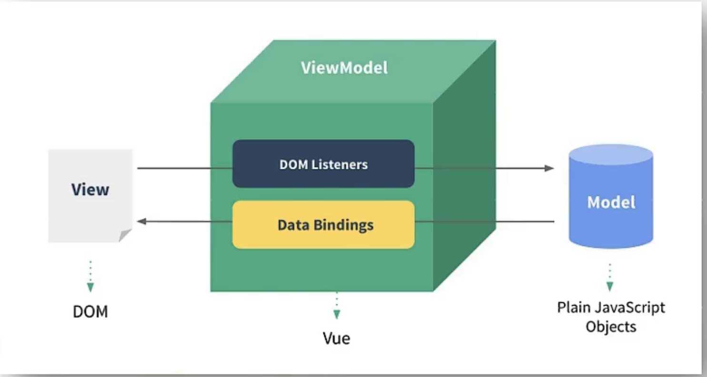
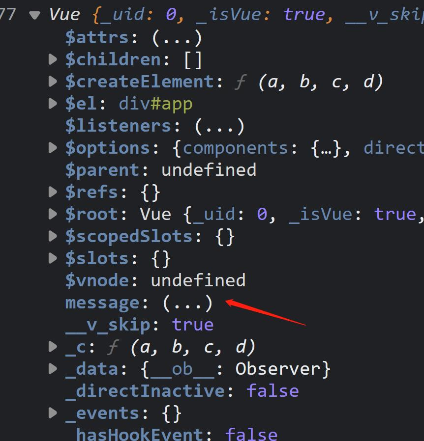

# Vue 基本使用

## 安装&引入

### 使用(安装)Vue 方式

单页面引入 CDN 或 使用脚手架
:::: code-group
::: code-group-item 开发环境

```html
<!-- 开发环境版本，包含了有帮助的命令行警告 -->
<script src="https://cdn.jsdelivr.net/npm/vue@2/dist/vue.js"></script>
```

:::
::: code-group-item 生产环境

```html
<!-- 生产环境版本，优化了尺寸和速度 -->
<script src="https://cdn.jsdelivr.net/npm/vue@2"></script>
```

:::
::: code-group-item ES Modules

```html
<script type="module">
  import Vue from "https://cdn.jsdelivr.net/npm/vue@2.7.14/dist/vue.esm.browser.js";
</script>
```

:::
::: code-group-item vue-cli 脚手架

```shell
# 最新稳定版
npm install vue
# OR
yarn global add @vue/cli
#安装之后查看版本
vue --version
```

:::
::::

### helloVue

下面写一个最简单的 vue 示例

```html
<div id="app">{{message}}</div>
<script src="https://cdn.jsdelivr.net/npm/vue@2/dist/vue.js"></script>
<script>
  //创建Vue实例,传一个参数值为对象(配置对象)
  new Vue({
    //el: document.getElementById('demo'), //可直接用document获取元素
    el: "#app", //el用于指定当前Vue实例为哪个容器服务，值为css选择器字符串。
    data: {
      //data中用于存储数据，数据供el所指定的容器去使用，值可以写成一个对象也可以是一个函数。
      message: "Hello Vue!",
    },
  });
</script>
```

::: tip 抛出疑问

1. F12 控制台中有 2 个提示信息,
   一个是提示安装 Devtools 插件,另一个是提示使用生产环境版本<br>Vue.config.productionTip = false
2. 一个 vue 实例只能接管一个容器,如下代码,只对第一个容器生效
3. 一个容器只能被第一个 Vue 实例管理,如下代码,只有第一个容器生效了
4. 容器和实例是一一对应的
   :::
   示例解析

```javascript
1.想让Vue工作，就必须创建一个Vue实例，且要传入一个配置对象;
  2.root容器里的代码依然符合htm1规范，只不过混入了一些特殊的Vue语法;
  3.root容器里的代码被称为[Vue模板] ;
  4.Vue实例和容器是一一对应的;
  5.真实开发中只有一个vue实例，并且会配合着组件一起使用;
  6.{{xxx}}中的xxx要写js表达式，且xxx可以自动读取到data中的所有属性;
  7.一旦data中的数据发生改变，那么页面中用到该数据的地方也会自动更新;
  注意区分: js表达式 和 js代码(语句)
  表达式:一个表达式会产生一个值，可以放在任何一个需要值的地方:
    (1).a
    (2).a+b
    (3). demo(1)
    (4).x === y ? a':"b'
  js代码(语句)
    (1).if(){}
    (2). for(){}
```

## 模版语法

模版语法通俗易懂的话就是在 html 中可以写一些特殊的符合或标记在运行时将这些替换为值

### 插值语法（双大括号表达式）

用于解析标签体内容,标签体指的就是标签中间内容的部分

```vue
<div id="app">{{xxx}}</div>
<script>
new Vue({
  el: "#app",
  data: {
    xxx: "唱跳rap篮球",
  },
});
</script>
```

### 指令语法(v-???)


以 `v-` 开头后边跟一些相关的关键词,用于解析标签（包括：标签属性、标签体内容、绑定事件…）。


```vue
<div id="app">
    <a v-bind:href="url">Google</a>
    <!-- v-bind:href="xxx" 或 简写为 :href="xxx"，xxx同样要写js表达式，且可以直接读取到data中的所有属性。 -->
    <a :href="url">Google</a>
  </div>
<script>
new Vue({
  el: "#app",
  data: {
    url: "google.com",
  },
});
</script>
```

## 数据绑定

### 单向数据绑定

在上方的指令语法中，已经体现了单向数据绑定<br>通俗易懂的解释就是 输入框的 value 只能从 data.val 读取到页面不能从页面修改后赋值到 data.val

```vue
<div id="app">
  <input type='text' v-bind:value="val">
</div>
<script>
new Vue({
  el: "#app",
  data: {
    val: "ikun",
  },
});
</script>
```

### 双向数据绑定

实现双向数据绑定需要使用到 `v-model` 指令

```vue
<!-- 将上面的示例中v-bind替换为v-model即可 -->
 <input type='text' v-model:value="val">
```

::: tip 一些提示
语法：v-mode:value="xxx" 或简写为 v-model="xxx"<br>
双向数据绑定的好处在于，只要一个地方将变量的值修改其他使用该变量的地方随之改变

<p style='color:red;'>* v-model 只能应用在表单类元素（输入类元素）上</p>
:::

## vue实例el和data

### el

```vue
<script>
var vm = new Vue({
   //el: '#demo',//第一种写法 
   data: { 
    name: "123",
     age: 18
    } 
  });
vm.$mount("#demo");//可以代替el绑定 //第二种写法 */
</script>
```

### data

```vue
<script>
  var vm = new Vue({
        el: '#demo',
        //data的第一种写法：对象式
        //data: {
        //    name: "123",
        //    age: 18
        //}

        //data的第二种写法：函数式
        //data: function () {
        //    console.log('@@@', this) //此处的this是Vue实例对象
        //    return {
        //        name: '1234',
        //        age: 18
        //    }
        //}
        //data的第二种写法：函数式,一般简写
        data() {
            console.log('@@@', this) //此处的this是Vue实例对象
            return {
                name: '1234',
                age: 18
            }
        }
    });
    // * 不能写箭头函数
</script>
```

## MVVM模型

::: tip 解释

1. M：模型(Model) ：data中的数据
2. V：视图(View) ：模板代码
3. VM：视图模型(ViewModel)：Vue实例
   :::


::: tip
1.data中所有的属性，最后都出现在了vm身上。  
2.vm身上所有的属性 及 Vue原型上所有属性，在Vue模板中都可以直接使用。
:::

## 数据代理

::: tip Object.defineProperty

```js
var person= {
    name: "张三",
    sex: "男"
}
//通过defineProperty给person对象添加一个age属性值为19
Object.defineProperty(person,"age",{
    value:19
})
console.log(person);
console.log(Object.keys(person));//提取对象的所有属性,变成一个数组.
```

查看打印结果发现，颜色不一样,age不可以被枚举,不参与遍历
可以开启属性枚举参与遍历

```js
Object.defineProperty(person,"age",{
    value:19,
    enumerable:true//控制属性是否可以枚举,默认值为false
})
```

可配置属性writable,控制属性是否可以被修改,默认值为false

```js
Object.defineProperty(person,"age",{
    value:19,
    enumerable:true,
    writable:true//控制属性是否可以被修改,默认值为false
})
```

可配置属性configurable,控制属性是否可以被删除,默认值为false

```js
Object.defineProperty(person,"age",{
    value:19,
    enumerable:true,
    writable:true,
    configurable:true//控制属性是否可以被删除,默认值为false
})
```

:::

#### get函数

可以实现动态调整值的作用,如果直接将number放入person中,即age:number,则不会根据number变化而变化.

```js
var number="19";
var person= {
    name: "张三",
    sex: "男"
}
Object.defineProperty(person,"age",{
    //当有人读取person的age属性时，get函数(getter)就会被调用，且返回值就是age的值
    get: function () {
        return number;
    }
})
```

::: warning 注意：
在使用Object.defineProperty() 定义对象属性的时候，如果设置了 set 或 get, 就不能设置 writable 和 value 中的任何一个，否则就会报错
:::

#### set函数

```js
set(value){
    console.log('有人修改了age属性，且值是',value)
    number = value
}
```

::: tip 什么是数据代理？
通过一个对象代理对另一个对象中属性的操作（读/写）

```js
var number="19";
    var obj= {
        x: "张三111"
    }
    var obj2= {
        y: "张三222"
    }
    Object.defineProperty(obj2,'x',{
        get(){
            return obj.x;
        },
        set(v){
            obj.x=v;
        }
    })
    console.log(obj);
    console.log(obj2);
```

:::
::: tip Vue中的数据代理

vm中的_data就是vue实例中的data对象— 包含数据劫持(看起来也像数据代理),

1.Vue中的数据代理：  
	通过vm对象来代理data对象中属性的操作（读/写）  
2.Vue中数据代理的好处：  
	更加方便的操作data中的数据  
3.基本原理：  
	通过Object.defineProperty()把data对象中所有属性添加到vm上。  
	为每一个添加到vm上的属性，都指定一个getter/setter。  
	在getter/setter内部去操作（读/写）data中对应的属性。  
:::
## 事件处理


