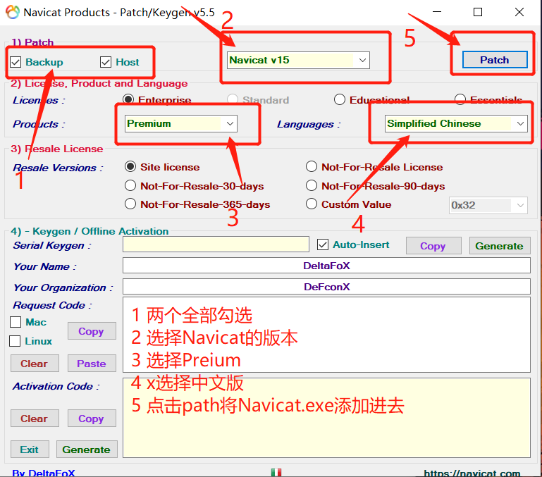
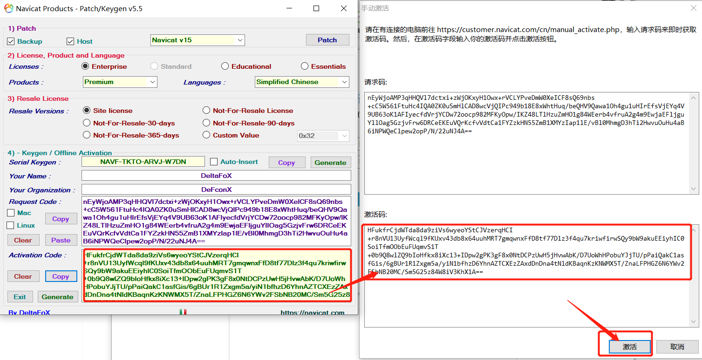
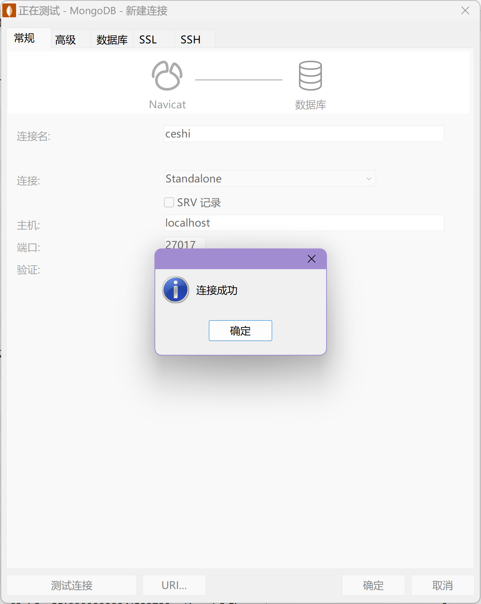
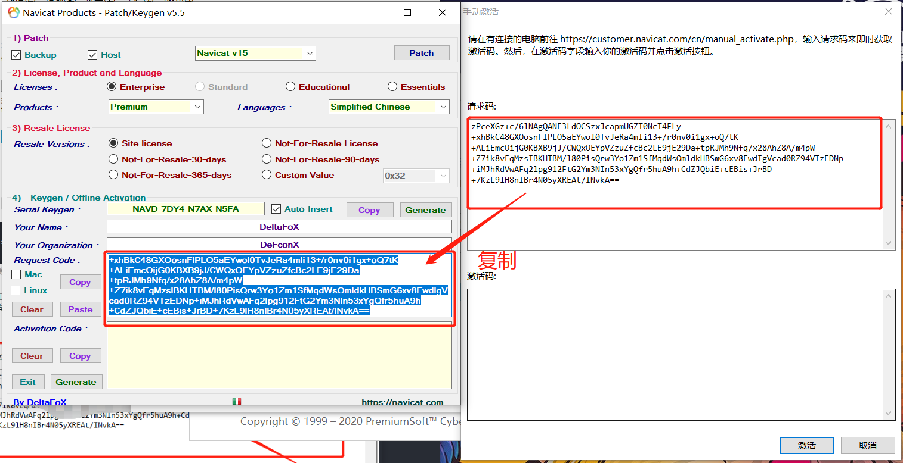
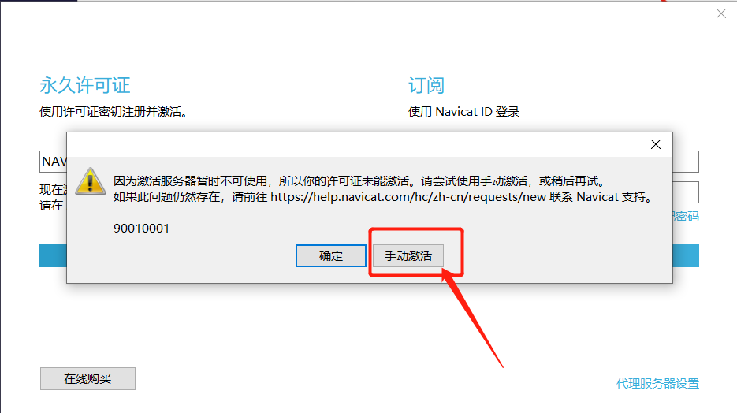
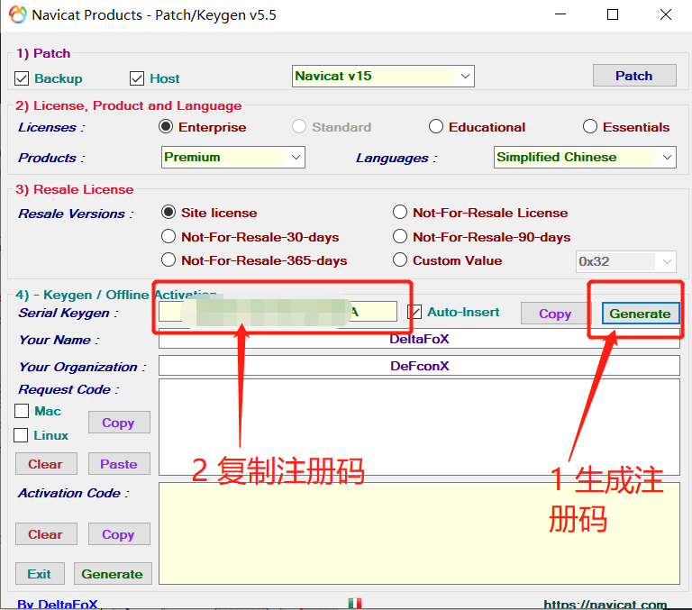
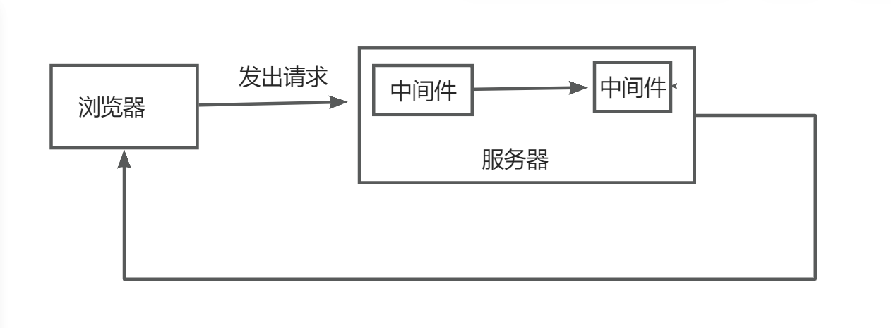

# NodeJs

## Express 框架

### 一、安装

```bash
# 初始化
    npm init -y
    # 安装express框架
    npm install express --save
    # 安装body-parser cookie-parser multer
    npm install body-parser --save
    npm install cookie-parser --save
    npm install multer --save
```

### 二、hello demo

:::: code-group
::: code-group-item index.js

```javascript
//引入框架
var express = require("express");
//获取框架的实例对象
var app = express();
//调用app的get方法传入2个参数
//第一个参数 访问路径  也叫做路由
//第二个参数 回调函数 做具体的业务使用
//  req==request 请求的一些信息  res==response 响应的一些
app.get("/", function (req, res) {
  //调用响应的函数send发送 响应信息
  res.send("Hello World");
});
app.get("/user", (req, res) => {
  res.json({ name: "李艳阳" });
});
app.post("/user", (req, res) => {
  console.log(req.query);
  res.json({
    msg: "success",
    code: 200,
  });
});
//启动一个对外的服务端口是8081
app.listen(8081, function () {
  console.log("启动成功");
});
```

:::
::::
::: tip 作业
使用文件系统完成，用户登录，修改用户信息
:::

### 三、安装应用生成器

```shell
npm install express-generator -g
```

在终端cmd或者vscode的终端 进入到 你想放置项目的目录

```shell
#helloworld为目录名
express helloworld
```

安装完成后cd 进入 目录 进行安装项目所需要的依赖并运行

```shell
cd helloworld
npm install
npm start
```

此时打开浏览器访问 ：[ http://127.0.0.1:3000/](http://127.0.0.1:3000/) 查看是否可以访问
::: tip 安装文件改动时自动重启服务器

```shell
npm install -g nodemon
# 这里还可以把它作为开发依赖将安装在本地，
# 于是使用这个项目的开发人员只要安装这个应用就能自动获得。
# 通过以下命令将其安装在骨架项目的根目录 
# npm install --save-dev nodemon
```

执行完毕后代 项目根目录的 package.json 文件查看是否下面这个属性

```json
"devDependencies": {
    "nodemon": "^X.XX.X"
  }
```

找到 package.json 的 scripts 部分。
在 "start" 一行的末尾添加逗号，并在新的一行中添加 "dev"，如下:

```json
"scripts": {
    "start": "node ./bin/www",
    "dev": "nodemon ./bin/www" //将此行命令添加到文件中
  },
```

现在可以使用下面命令尝试启动项目

```shell
npm run dev
```

:::

### 四、Mysql 安装

根据自己的系统版本下载对应的安装包
[官网下载地址](https://dev.mysql.com/downloads/mysql/)
下载完成后解压到指定目录<br>
在mysql目录下创建配置文件

```ini
[client]
# 设置mysql客户端默认字符集
default-character-set=utf8
 
[mysqld]
# 设置3306端口
port=3306
# 设置mysql的安装目录
basedir=C:\\web\\mysql-8.0.11
# 允许最大连接数
max_connections=20
# 服务端使用的字符集默认为8比特编码的latin1字符集
character-set-server=utf8
# 创建新表时将使用的默认存储引擎
default-storage-engine=INNODB
```

访问bin目录打开cmd终端初始化mysql(需要管理员的身份)

```shell
mysqld --initialize --console
```

执行完成后，会输出 root 用户的初始默认密码，如:

```shell
...
2018-04-20T02:35:05.464644Z 5 [Note] [MY-010454] [Server] A temporary password is generated for root@localhost: APWCY5ws&hjQ
...
```

安装启动mysql

```shell
mysqld install
net start mysql
```

登录mysql

```shell
mysql -h 主机名 -u 用户名 -p
```

修改默认密码和远程访问的权限

```shell
# 1.登录
mysql -u root -p
#  2.选择数据库
use mysql;
# 3. 修改root密码
#修改初始密码
ALTER USER 'root'@'localhost' IDENTIFIED WITH mysql_native_password BY '123456';
#之后修改密码使用下面的语句
ALTER USER 'root'@'%' IDENTIFIED WITH mysql_native_password BY '123456';
# 4.修改远程访问权限
update user set host = '%' where user = 'root';
# 5.刷新权限
FLUSH PRIVILEGES;
# 6.退出 
exit;
```

#### 安装navicat工具

先把杀毒软件关闭！！！
1、下载好压缩包 先进行解压
2、先安装navicat150_premium_cs_x64.exe 安装完之后不要打开程序
3、运行破解工具Navicat Keygen Patch v5.6.0 DFoX.exe













### 五、中间件使用

::: tip 中间件是什么？

中间件就是一堆方法，接收客户端发来的请求，对请求做出响应
中间件由两部分构成，中间件方法和请求处理函数，中间件方法由Express提供，负责拦截请求，请求处理函数自己提供，负责处理请求
可以对一个请求设置多个中间件，对同一个请求进行多次处理，按代码的顺序“由上到下”依次匹配，匹配成功，终止匹配，可以使用next函数将控制权交给下一个中间件，指定请求处理结束


:::

中间件的使用
在routes中新建一个js文件（demo.js）

```javascript
//demo.js
//导入express模块
const express = require('express')
//创建服务器
const app = express.Router()

//定义中间件
app.get("/get_data",(req,res,next) => {
  req.name = '张三'
  next(); //向下执行
})
app.get("/get_data",(req,res) => {
  res.send(req.name)//返回响应
})
```

中间件执行过程：代码顺序，由上至下

**app.use()中间件的使用：**

* 当参数中只有一个处理函数时，代表匹配所有请求
* 指定了url，接收指定的请求

```javascript
//导入express模块
const express = require('express')
//创建服务器
const app = express.Router()

//处理全部请求
app.use((req,res,next)=>{
  console.log('请求走了')
  next()
})
//处理get_data请求
app.use('/get_data',(req,res,next) => {
  console.log("get_data 请求走了")
  next()
})
```

错误中间件定义：

```javascript
//错误处理中间件
//导入express模块
const express = require('express')
//创建服务器
const app = express.Router()

app.use((err,req,res,next) => {
  //设置错误码（状态），并响应请求
  res.status(500).send(err.message)
})
```

例如：项目中没有demo.txt文件，会出现错误

```javascript
//导入express模块
  const express = require('express')
  //创建服务器
  const app = express.Router()

  const fs = require('fs')

  //处理index请求
  //项目中没有demo.txt文件，会出现错误
  app.get('/index',(req,res,next) => {
    fs.readFile("./demo.text",'utf8',(err,result) => {
      if(err != null){
        //文件读取失败，向下传递错误对象
        next(err)
      }else{
        res.send(result)
      }
    })
  })

  //错误处理中间件
  app.use((err,req,res,next) => {
    //设置错误码（状态）
    res.status(500).send(err.message)
  })
  module.exports = app
```

如果想要这些请求和中间件生效，那么需要在app.js中定义如下代码

```javascript
//导入模块
var demoRouter = require('./routes/demo')
//第一个参数，请求名称，第二个参数，路由模板
app.use('/demo',demoRouter) //  localhost:3000/demo/index
```

### 六、参数获取

1. req.query 获取get请求参数
2. post参数获取 通过body-parser中间件

```javascript
//导入模块
var express = require('express');
const bodyParser = require('body-parser');

// 拦截所有请求
// extended: false  方法内部使用 querystring 模块处理请求参数的格式
// extended: true   方法内部使用第三方模块 qs 来处理请求参数的格式
// 建议使用false
app.use(bodyParser.urlencoded({extended: false}));
//post请求参数的获取：借助body-parser
app.post("/home",(req,res) => {
  console.log(req.body)
  res.send(req.body)
})
```

ajax发起请求时 数据类型为：application/x-www-form-urlencoded<br>
3. 路由参数获取

```javascript
//localhost:3000/route/123/tom
//路由参数：
app.get("/route/:id/:name",(req,res) => {
  console.log(req.params)// {"id": "123","name": "tom"}
  res.send(req.params)
})
```

完整示例：app.js

```javascript
const express = require('express')

//创建服务器
const app = express.Router()

//请求处理
app.get("/index",(req,res) => {
  res.send("欢迎来到德莱联盟")
})
//参数的获取:
//get参数的获取
app.get("/main",(req,res) => {
  // 设置头部信息，如跨域
  // res.header()
  console.log(req.query)
  // res.send("欢迎"+req.query.name+"来到德莱联盟")
  res.send(req.query)
})
//post请求参数的获取：借助body-parser
app.post("/home",(req,res) => {
  console.log(req.body)
  res.send(req.body)
})
//路由参数：
app.get("/route/:id/:name",(req,res) => {
  console.log(req.params)// {"id": "123","name": "tom"}
  res.send(req.params)
})

module.exports = app
```

### 七、连接mysql数据库
安装mysql扩展
```bash
npm install mysql
```
在项目根目录创建一个dataBase文件夹,此文件夹用于存放操作数据库的文件
```javascript
  //config.js
  module.exports = {
    db: {
      host: "数据地址",
      port: "端口",
      user: "用户名",
      password: "密码",
      database: "数据库名称",
    },
  };

```
```javascript
//db.js
const mysql = require("mysql");
const config = require("./config").db;
//连接数据库
module.exports = mysql.createConnection(config);
```
接下来根据业务需要定义相关模块的数据库操作方法
例如 创建一个Car.js汽车的数据相关操作
connection.query():
第一个参数：sql语句 — 字符串
第二个参数：参数值 — 数组
第三个参数：操作数据库之后执行的回调函数 (err：查询错误，data：查询结果) — function
注意：第二个参数可以没有，既当不需要任何参数时，我们可以不传；如果回调函数中的 err 为 null ，则操作数据库成功
增删改查：
```javascript
// Car.js
const connection = require('./db')

//查询
const getCar = () => {
  return new Promise((resolve, reject) => {
    //第一个参数：sql语句
    //第二个参数：回调函数（err：查询错误，data：查询结果）
    connection.query("select * from Car",(err,data) => {
      resolve(data)
    })
  })
}
//添加
const insertCar = (param) => {
  return new Promise((resolve,reject) => {
    connection.query("insert into Car(name,color) values(?,?)",[param.name,param.color],(err,data) => {
      //如果err为null则成功
      resolve(data)
    })
  })
}
//改
const updateCar = (param) => {
  return new Promise((resolve,reject) => {
    connection.query("update car set username = ? where phone = ?",param,(err,data) => {
      //如果err为null则成功
      resolve(data)
    })
  })
}

//删除
const deleteCar = (param) => {
  return new Promise((resolve,reject) => {
    connection.query("delete from car where id = ?",param,(err,data) => {
      resolve(data)
    })
  })
}
//导出方法，在需要使用到的模块中导入
module.exports = {
  getCar,
  insertCar,
  updateCar,
  deleteCar
}
```
在汽车控制器方法中调用操作数据库的方法：
在项目根目录下创建Controller文件夹,此文件夹用来存放控制器文件
```javascript
//CarController.js
const express = require('express')

//创建服务器
const app = express.Router()

const {getCar,insertCar,updateCar,deleteCar} = require('../dataBase/Car')

app.get("/getCar",(req,res,next) => {
  getCar()
  .then(response => {
    res.send(response)
  })
})

app.post("/insertCar",(req,res,next) => {
  let param = req.body
  let {username,phone,password} = param
  insertCar([username,phone,password])
  .then(response => {
    res.send(response)
  })
})

app.post("/updateCar",(req,res,next) => {
  let param = req.body
  let {username,phone} = param
  updateCar([username,phone])
  .then(response => {
    res.send(response)
  })
})

app.get("/deleteCar",(req,res,next) => {
  let id = req.query.id
  deleteCar([id])
  .then(response => {
    res.send(response)
  })
})

module.exports = app
```
在routes文件夹 新建相关模块路由js文件  
::: tip carRouter.js
```javascript
var express = require('express');
var router = express.Router();
//引入控制器文件
var carController = require('../controller/carController')

//相对于的路径访问相对于控制器的方法
router.get('/',carController.getCarList );

module.exports = router;
:::
在app.js中添加路由
```javascript
var carRouter = require('./routes/carRoute');
app.use('/users', usersRouter);
```
解决跨域访问
```javascript
//app.js
//解决跨域访问
app.all("*", function (req, res, next) {
  res.header("Access-Control-Allow-Origin", "*");
  res.header(
    "Access-Control-Allow-Headers",
    "X-Requested-With,Content-Type,Authorization,token"
  );
  res.header("Access-Control-Allow-Methods", "PUT,POST,GET,DELETE,OPTIONS");
  res.header("Content-Type", "application/json;charset=utf-8");
  next();
});
```
### 八、暴露静态文件
在app.js中配置：
```javascript
//暴露静态文件：可访问 ， 如：http://localhost:3000/images/logo.png
//把public路径下的所有静态文件暴露出来，既可以访问
app.use(express.static(path.join(__dirname, 'public')));
```